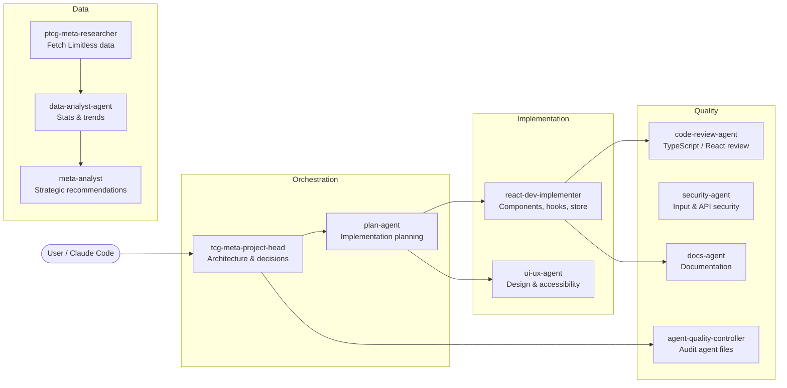

# Claude Agent Ecosystem

The project uses a multi-agent system built on Claude Code. Each agent is defined in `.claude/agents/` as a markdown file with a YAML frontmatter header (`name`, `description`, `model`, `memory`). Agents are invoked by the user or by other agents using the `Agent` tool.

---

## Agent Overview



---

## Agent Reference

### `tcg-meta-project-head`
**Role:** Highest-level orchestrator. Makes architectural decisions, resolves cross-agent conflicts, evaluates new feature requests.

**When to trigger:**
- Starting a new major feature
- Diagnosing issues that span multiple parts of the app (e.g., performance, schema conflicts)
- Deciding between competing approaches
- Any time specialized agents produce conflicting outputs

**Delegates to:** All other agents. Standard feature flow: `plan-agent → react-dev-implementer → code-review-agent + docs-agent`.

---

### `plan-agent`
**Role:** Creates a detailed implementation plan before any code is written. Reduces wasted effort from architectural missteps.

**When to trigger:** Before any non-trivial implementation task. The project head triggers it automatically in the standard delegation flow.

**Output:** A step-by-step plan with: component design, data flow, DB impact, edge cases, and agent assignments.

---

### `react-dev-implementer`
**Role:** Implements React components, hooks, store actions, and utility functions. Follows strict clean code, TDD, and inline JSDoc standards.

**When to trigger:** When new code needs to be written or existing React code needs refactoring.

**Handoff protocol:** After implementing, explicitly signals:
- `code-review-agent`: Review TypeScript/React/Dexie standards
- `docs-agent`: Create companion `.md` documentation

---

### `code-review-agent`
**Role:** Reviews implemented code against TypeScript, React, and Dexie best practices. Checks for type safety, performance, error handling, and accessibility.

**When to trigger:** After every implementation by `react-dev-implementer`.

---

### `security-agent`
**Role:** Reviews any new user input processing, API calls, or dependency updates for security issues.

**When to trigger:**
- New form inputs or user-supplied data processing (e.g., deck import, battle log paste)
- New external API calls
- Dependency version updates

**Key concern for this project:** The `analyzeBattleLog` function sends user data and an API key directly to the Anthropic API from the browser. The security agent should review any changes to that flow.

---

### `ui-ux-agent`
**Role:** Designs UI components, chart configurations, color choices, and accessibility improvements. Produces wireframes or specifications before implementation.

**When to trigger:**
- New pages or significant layout changes
- Chart or visualization additions
- Accessibility issues

---

### `data-analyst-agent`
**Role:** Analyzes personal match data and meta snapshots to produce quantitative insights — win rates, trends, card performance correlations. Delivers numbers, not strategy.

**When to trigger:** When the user wants to understand patterns in their match history or meta trends. Receives data from `ptcg-meta-researcher` and forwards insights to `meta-analyst`.

---

### `ptcg-meta-researcher`
**Role:** Fetches and interprets external competitive TCG data from Limitless TCG and similar sources. Provides raw tournament data and archetype context.

**When to trigger:** When the user wants to understand the current competitive landscape, fetch tournament standings, or research a specific archetype's performance.

---

### `meta-analyst`
**Role:** Converts quantitative insights (from `data-analyst-agent`) into strategic deck recommendations. Thinks about matchup implications, tech choices, and sideboard strategy.

**When to trigger:** After `data-analyst-agent` has produced metrics. Also triggered directly when the user wants high-level deck strategy advice.

---

### `docs-agent`
**Role:** Writes and maintains documentation — component docs, directory READMEs, the main README, this `/docs/` directory, and JSDoc audits.

**When to trigger:**
- After any implementation is complete (triggered by `react-dev-implementer` handoff)
- When the project structure changes significantly
- For periodic JSDoc audits of `src/lib/` and `src/db/queries.ts`

**Principle:** Documentation must reflect the current code. Reads all affected files before writing.

---

### `agent-quality-controller`
**Role:** Audits the agent definition files themselves in `.claude/agents/`. Ensures agent descriptions are accurate, trigger conditions are clear, and there are no duplicate responsibilities.

**When to trigger:** After adding a new agent, or when agents appear to be behaving inconsistently.

---

## Standard Delegation Flows

### New feature
```
User → tcg-meta-project-head → plan-agent → react-dev-implementer
                                              ↓                    ↓
                                    code-review-agent          docs-agent
```

### Design decision
```
User → ui-ux-agent (wireframe + spec) → react-dev-implementer (implementation)
```

### Data / meta feature
```
User → ptcg-meta-researcher → data-analyst-agent → meta-analyst → react-dev-implementer
```

### Security check
```
Any new input processing → security-agent (always, before merging)
```

### Agent maintenance
```
User → agent-quality-controller (after adding agents or on misbehavior)
```

---

## Agent Memory System

Each agent has a persistent memory directory at `.claude/agent-memory/<agent-name>/`. Memories are stored as individual markdown files with YAML frontmatter. The agent's `MEMORY.md` file is an index.

Memory types:
- `user` — user role, expertise level, preferences
- `project` — ongoing work, decisions, deadlines
- `feedback` — corrections and validated approaches
- `reference` — pointers to external resources

Memories persist across conversations. Agents are expected to read relevant memories at the start of a session and write new memories when they discover non-obvious facts about the project or user preferences.

---

## Workflow Example: Adding a New Chart

1. User: "Add a prize efficiency chart to the Analytics tab"
2. `tcg-meta-project-head` evaluates: data available in `DeckPerformanceStats.prizeEfficiency`, good fit for Recharts `BarChart`
3. `plan-agent` drafts: component name `PrizeEfficiencyChart`, props interface, which page it goes in, no DB changes needed
4. `ui-ux-agent` specifies: color scheme consistent with existing charts, label format, empty state
5. `react-dev-implementer` implements: `PrizeEfficiencyChart.tsx` with JSDoc, TDD test file
6. `code-review-agent` reviews: checks prop types, memoization, empty state handling
7. `docs-agent` creates: `PrizeEfficiencyChart.md` with props table, usage example, Mermaid data flow diagram
