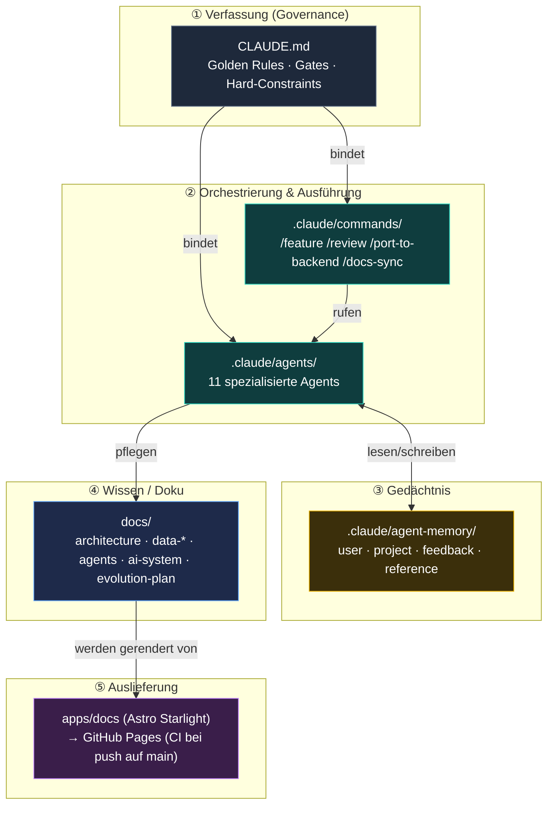
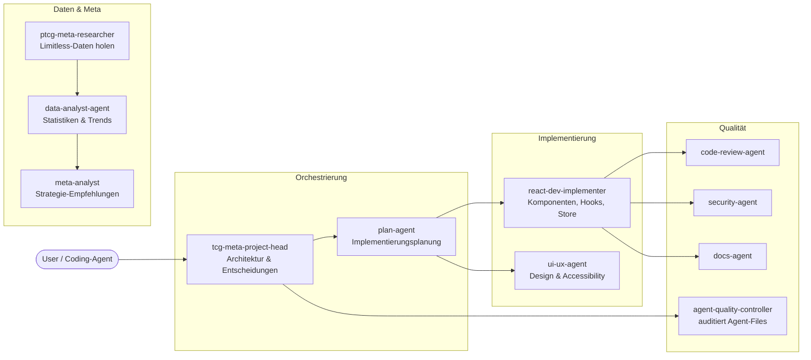
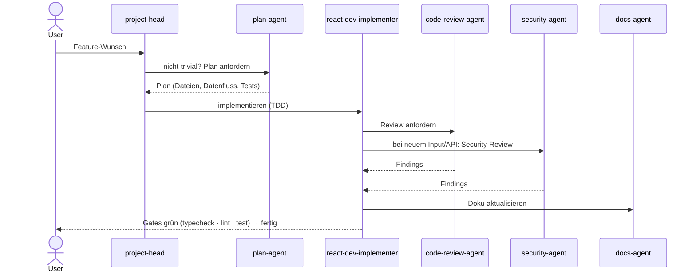
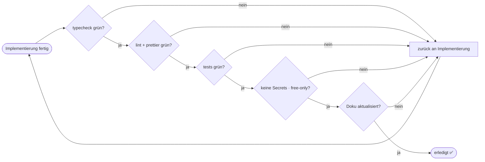
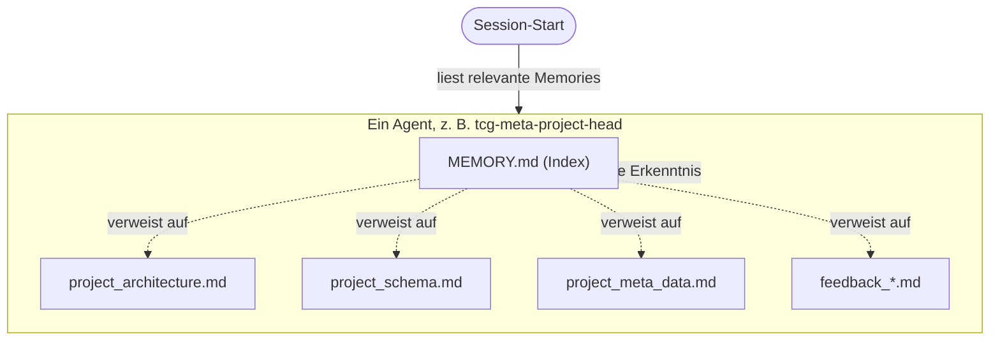
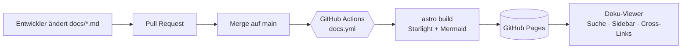
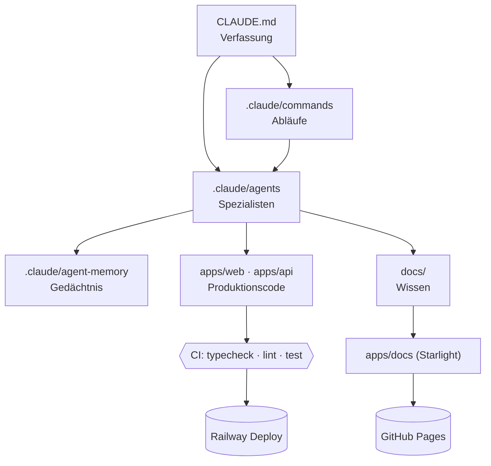

# Das KI-System von Pokekon

> **Was dieses Dokument ist:** Die menschenlesbare Gesamtübersicht über die KI-/Agenten-Umgebung dieses Repositories — wie Leitplanken, Agents, Gedächtnis, Prompt-Bausteine und Dokumentation zusammenspielen. Es ergänzt die maschinen-/assistenten-gerichtete Verfassung [`../CLAUDE.md`](../CLAUDE.md) und die reine Agent-Referenz [`agents.md`](./agents.md).
>
> **Stand:** 2026-06-17 · **Gilt für:** Claude Code, Cowork und jeden Coding-Agent, der im Repo arbeitet.

---

## 1. Idee in einem Satz

Statt einem einzelnen, frei agierenden Assistenten gibt es in `pokekon` ein **mehrschichtiges KI-System**: eine oberste Verfassung (`CLAUDE.md`) legt Grenzen fest, spezialisierte **Agents** erledigen klar abgegrenzte Aufgaben, ein **Memory-System** trägt Wissen über Sessions hinweg, **Commands** kapseln wiederkehrende Abläufe, und die **lebende Dokumentation** macht das Ganze nachvollziehbar.

---

## 2. Schichtenmodell

Die KI-Umgebung besteht aus fünf Schichten. Obere Schichten setzen die Leitplanken, untere führen aus.

| Schicht | Ort | Verantwortung |
|--------|-----|---------------|
| ① Verfassung | [`CLAUDE.md`](../CLAUDE.md) | Nicht verhandelbare Regeln, Workflow, Quality-Gates. Hat Vorrang vor allem darunter. |
| ② Orchestrierung | [`.claude/agents/`](../.claude/agents/), [`.claude/commands/`](../.claude/commands/) | Wer macht was; wiederverwendbare Abläufe. |
| ③ Gedächtnis | `.claude/agent-memory/` | Persistentes Wissen pro Agent über Sessions hinweg. |
| ④ Wissen | [`docs/`](./) | Architektur, Datenmodell, Roadmap, dieses Dokument. |
| ⑤ Auslieferung | `apps/docs` (geplant) | Starlight-Viewer, automatisch auf GitHub Pages. |

---

## 3. Die Verfassung (`CLAUDE.md`)

Die oberste Schicht. Kernpunkte (vollständig in [`../CLAUDE.md`](../CLAUDE.md)):

- **Erst lesen, dann behaupten** — keine Aussage über Code ohne die Datei gelesen zu haben.
- **Kostenlos bleiben** — keine bezahlten APIs/Dependencies ohne Freigabe.
- **Secrets serverseitig** — API-Keys nie im Browser-Bundle.
- **Eine Quelle der Wahrheit** — keine neue IndexedDB↔API-Doppelung.
- **Tests & Lint grün = fertig** — `typecheck`, `lint`, `test` müssen durchlaufen.
- **Anti-Halluzination** der KI-Analyse bleibt erhalten (Evidence-Quotes, `temperature=0`).
- **Doku folgt dem Code** — strukturändernde Arbeit aktualisiert `docs/`.

Bei Konflikt zwischen einem Agent-File und der Verfassung **gewinnt die Verfassung**, und der Widerspruch wird gemeldet.

### Anti-Halluzinations-Architektur: zwei Analyse-Typen

Das Projekt hat zwei LLM-Analyse-Modi (siehe [`features.md` §8 & §19](./features.md)), die sich in der Art des Groundings unterscheiden:

| Typ | Input | Grounding | Validierung | Use Case |
|-----|-------|-----------|-------------|----------|
| **Battle-Log-Analyse** (§8) | Rohtext aus TCG Live (deutsches Protokoll) | **Wörtliches Zitat:** jede Aussage muss einen verbatim Quote aus dem Rohlog nennen (`evidenceExistsInLog`). | After-parse: Aussagen ohne Beleg werden verworfen (`validateAnalysis`). | Spielzug-Kritik, Fehler identifizieren. |
| **Deck-Synthese** (§19) | Geschlossene Fakten-Liste (Field-Score, Matchups, Card Deltas, Equilibrium) | **Struktur + Richtung:** Aussage muss auf einen Fakt in der Liste zeigen (`factId`), und die Richtung der Aussage muss zum **aus dem Konfidenzband abgeleiteten** Vorzeichen des Fakts passen. | Parallel zu & nach Parsing: Richtung abgeleitet (`deriveFactDirection`), Zahlen sind Platzhalter (Server rendert). | Gesamtdeck-Empfehlungen gegen das Feld. |

Beide nutzen `temperature: 0`, JSON-Struktur und die **geteilte Engine** `@pokekon/shared`; ein **provider-agnostischer Adapter** (`apps/api/src/ai/`) erlaubt Provider-Wechsel ohne Logik-Änderung. Das ist ein Designziel aus CLAUDE.md Golden Rule 6: Anti-Halluzination bleibt, wird nicht aufgeweicht.

---

## 4. Agent-Roster (Schicht ②)

Elf Agents, gruppiert nach Funktion. Details und Trigger-Beispiele in [`agents.md`](./agents.md); die Definitionen liegen in [`.claude/agents/`](../.claude/agents/).

| Gruppe | Agent | Kurzrolle |
|--------|-------|-----------|
| Orchestrierung | `tcg-meta-project-head` | Höchster Orchestrator, Architektur, Konfliktlösung |
| Orchestrierung | `plan-agent` | Plan vor jeder nicht-trivialen Implementierung |
| Implementierung | `react-dev-implementer` | React-Komponenten, Hooks, Store, Utils (TDD) |
| Implementierung | `ui-ux-agent` | Design, Charts, Accessibility, Wireframes |
| Daten | `ptcg-meta-researcher` | Externe TCG-/Turnierdaten holen |
| Daten | `data-analyst-agent` | Quantitative Insights (Zahlen, keine Strategie) |
| Daten | `meta-analyst` | Strategische Deck-Empfehlungen aus den Zahlen |
| Qualität | `code-review-agent` | TS/React/Dexie-Review (rein lesend) |
| Qualität | `security-agent` | Input-Processing, API-Calls, Dependencies |
| Qualität | `docs-agent` | Doku schreiben & aktuell halten |
| Qualität | `agent-quality-controller` | Auditiert die Agent-Files selbst (Meta-Ebene) |

---

## 5. Standard-Flows (wie Arbeit fließt)

Der Standard-Lebenszyklus eines Features — durchgesetzt durch `CLAUDE.md` und gekapselt im Command [`/feature`](../.claude/commands/feature.md):

Weitere Flows (aus [`agents.md`](./agents.md)):

- **Design-Entscheidung:** `ui-ux-agent` → `react-dev-implementer`
- **Daten-/Meta-Feature:** `ptcg-meta-researcher` → `data-analyst-agent` → `meta-analyst`
- **Security-Check:** jedes neue Input-Processing → `security-agent` (Pflicht vor Merge)
- **Agent-Wartung:** neue/auffällige Agents → `agent-quality-controller`

---

## 6. Quality-Gates (das Tor zu „fertig")

Kein Stück Arbeit gilt als erledigt, bevor diese Tore offen sind:

Technisch abgesichert durch husky + lint-staged (Prettier pre-commit) und `.github/workflows/ci.yml`.

---

## 7. Gedächtnis-System (Schicht ③)

Jeder Agent hat ein persistentes Verzeichnis `.claude/agent-memory/<agent-name>/`. Memories sind einzelne Markdown-Dateien mit YAML-Frontmatter; `MEMORY.md` je Agent ist der Index.

Vier Memory-Typen: **user** (Rolle/Präferenzen), **project** (laufende Arbeit/Entscheidungen), **feedback** (Korrekturen & bestätigte Ansätze, mit *Warum*), **reference** (Zeiger auf externe Ressourcen). Memories sind versioniert und werden mit dem Team geteilt — daher projektbezogen formulieren, keine sensiblen Daten.

---

## 8. Auslieferung: lebende Dokumentation (Schicht ⑤)

Die Doku unter [`docs/`](./) ist die Quelle der Wahrheit. Sie wird (geplant) als **Astro Starlight** in `apps/docs` gerendert und bei jedem Push auf `main` automatisch und **kostenlos** auf GitHub Pages deployt.

Warum Starlight: automatische Sidebar/Hierarchie aus der Ordnerstruktur, Volltextsuche, native Cross-Links zwischen `.md`-Dateien und Mermaid-Rendering — genau das gewünschte „Verzeichnis aus gut verlinkten, hierarchischen `.md`-Files". Details und Umsetzung in [`backend-evolution-plan.md`](./backend-evolution-plan.md) Abschnitt 8 und im Implementierungs-Prompt unter [`prompts/`](./prompts/).

---

## 9. Wie alles zusammenhängt (Gesamtbild)

---

## 10. Bekannte Drift / Pflege-Hinweise

- **`architecture.md` — Drift behoben (2026-08):** Die frühere „zero-backend SPA"-Beschreibung ist korrigiert; die Datei beschreibt jetzt die reale Hono+Postgres-Architektur mit serverseitiger, provider-agnostischer LLM-Analyse (siehe [`backend-evolution-plan.md`](./backend-evolution-plan.md) Abschnitt 1).
- **Agent-Definitionen vs. Realität:** Einige Agent-Files (z. B. `tcg-meta-project-head`) beschreiben den Stack noch rein Dexie-zentriert. Beim nächsten `agent-quality-controller`-Lauf an die Backend-Realität angleichen.
- **Pflege:** Bei neuen Agents/Commands dieses Dokument und [`agents.md`](./agents.md) mitführen (`/docs-sync`).

---

## Verweise

- [`../CLAUDE.md`](../CLAUDE.md) — Verfassung / Hard-Rules
- [`agents.md`](./agents.md) — Agent-Referenz & Flows
- [`backend-evolution-plan.md`](./backend-evolution-plan.md) — Roadmap inkl. Battle-Log-Zugqualität & Doku-Viewer
- [`architecture.md`](./architecture.md) — App-Architektur
- [`../.claude/commands/`](../.claude/commands/) — Prompt-Bausteine
