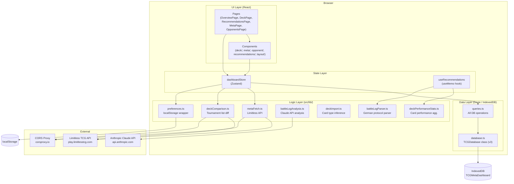

# Architecture Overview

## Purpose

The Pokemon TCG Meta Dashboard is a **local-first, zero-backend Single Page Application** that helps competitive players track the tournament meta, manage their personal deck, log match results, and receive data-driven recommendations.

Because all data stays in the browser (IndexedDB), there is no server, no authentication, and no network dependency beyond the optional Limitless TCG API sync.

---

## Tech Stack

| Layer | Library / Tool | Version |
|-------|---------------|---------|
| UI framework | React | 19.2.4 |
| Language | TypeScript | ~6.0.2 |
| Build tool | Vite | 8.0.4 |
| State management | Zustand | 5.0.12 |
| Database | Dexie (IndexedDB) | 4.4.2 |
| Server-state caching | TanStack Query | 5.99.0 |
| Charts | Recharts | 3.8.1 |
| Icons | Lucide React | 1.8.0 |
| CSS | Tailwind CSS | 3.4.19 |
| Linting | ESLint + typescript-eslint | 9.x / 8.x |

---

## High-Level Layer Diagram



---

## Application Shell

`App.tsx` is minimal: it calls `seedIfEmpty()` and `store.refresh()` on mount, then renders `Sidebar` + `BottomNav` (layout) and one of four page components based on `store.activeTab`:

```
overview  → OverviewPage
deck      → DeckPage
recommendations → RecommendationsPage
meta      → MetaPage
```

`OpponentsPage` is a standalone component but is not a separate tab — opponent log functionality is embedded in `DeckPage`'s "Match Log" section.

---

## Component Tree

```mermaid
graph TD
    App --> Sidebar
    App --> BottomNav
    App --> OverviewPage
    App --> DeckPage
    App --> RecommendationsPage
    App --> MetaPage

    OverviewPage --> StatCard
    OverviewPage --> MetaShareChart
    OverviewPage --> WinRateChart
    OverviewPage --> MetaTable_Overview["MetaTable (overview)"]

    DeckPage --> DeckSwitcher
    DeckPage --> DeckPanel
    DeckPage --> DeckAnalyticsPanel
    DeckPage --> OpponentLog
    DeckPage --> LocalMetaPanel
    DeckPage --> SidePanel

    DeckPanel --> AddCardModal
    DeckPanel --> ImportDeckModal

    DeckAnalyticsPanel --> DeckPerformancePanel
    DeckAnalyticsPanel --> MatchupMatrix_Deck["MatchupMatrix"]

    OpponentLog --> AddLogModal
    OpponentLog --> MatchDetailModal
    OpponentLog --> MatchStatsTab

    RecommendationsPage --> RecommendationsPanel
    RecommendationsPage --> DeckComparisonPanel

    MetaPage --> MatchupMatrix
    MetaPage --> MetaTable_Meta["MetaTable (meta)"]
    MetaPage --> CollapsibleSection
```



---

## State Management Pattern

There is a single Zustand store (`useDashboardStore`) that owns:

- **Data arrays**: `decks`, `deckCards`, `deckSnapshots`, `opponentLogs`, `metaSnapshots`, `archetypeStats`, `recentTournaments`
- **Active deck cursor**: `activeDeckId`, `activeDeck` (derived)
- **User preferences** (localStorage-backed): `localMeta`, `deckArchSlug`
- **Async operation state**: loading flags, progress strings, error strings for sync / comparison / tournaments
- **UI state**: `activeTab`, `lastRefreshed`, `lastSynced`

The `refresh()` action is the single entry point to reload all data from IndexedDB. Every mutation action (create/update/delete deck, add log, sync meta, etc.) ends with `await get().refresh()` to keep the store consistent.

---

## Data Persistence

| Data | Storage | Key |
|------|---------|-----|
| Decks, cards, logs, snapshots, meta | IndexedDB via Dexie | `TCGMetaDashboard` database |
| Active deck ID | localStorage | `tcg-active-deck-id-v3` |
| Local meta archetypes | localStorage | `tcg-local-meta-v1` |
| Deck archetype slug | localStorage | `tcg-deck-arch-slug-v1` |
| Player name (for battle log parsing) | localStorage | `tcg-player-name` |

---

## External API Integration

Both `metaFetch.ts` and `deckComparison.ts` use an identical two-step fetch strategy:

1. Try the Limitless API directly (`play.limitlesstcg.com/api/...`)
2. On failure (CORS or HTTP error), fall back to `corsproxy.io`

Neither endpoint requires authentication. The Claude API call in `battleLogAnalysis.ts` requires an API key entered by the user — it is sent directly from the browser (no proxy).

---

## Responsive Layout

The app uses a sidebar navigation on medium+ screens and a bottom nav bar on mobile. The main content area is capped at `max-w-screen-2xl` and uses `p-3 md:p-4` padding. The dark color scheme uses `bg-gray-950` as the base with Tailwind utility classes throughout.
