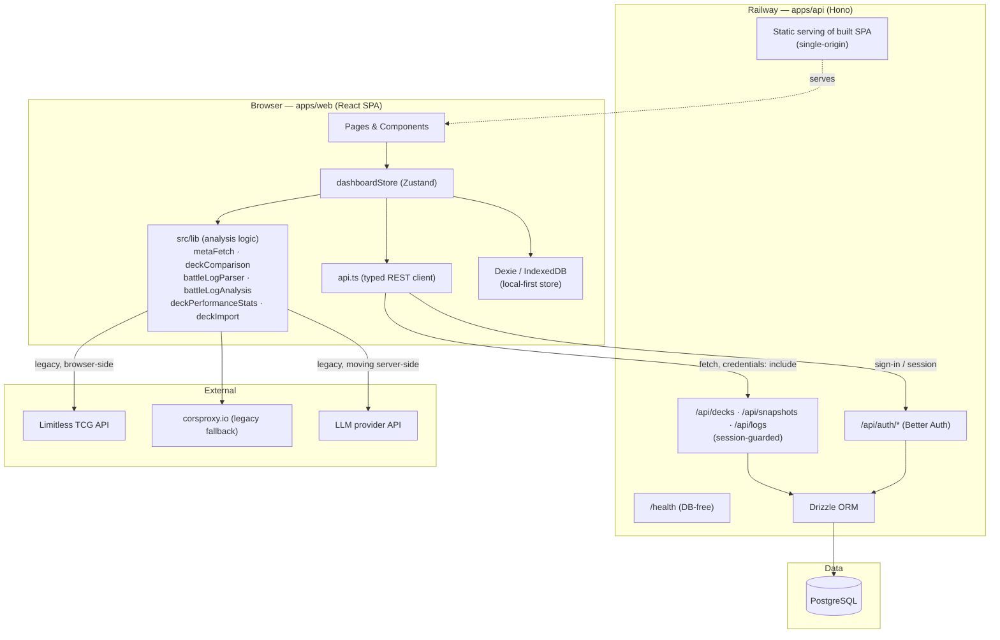

```mermaid
graph TD
    App --> Sidebar
    App --> BottomNav
    App --> OverviewPage
    App --> DeckPage
    App --> RecommendationsPage
    App --> MetaPage

    OverviewPage --> StatCard
    OverviewPage --> MetaShareChart
    OverviewPage --> WinRateChart
    OverviewPage --> MetaTable_Overview["MetaTable (overview)"]

    DeckPage --> DeckSwitcher
    DeckPage --> DeckPanel
    DeckPage --> DeckAnalyticsPanel
    DeckPage --> OpponentLog
    DeckPage --> LocalMetaPanel
    DeckPage --> SidePanel

    DeckPanel --> AddCardModal
    DeckPanel --> ImportDeckModal

    DeckAnalyticsPanel --> DeckPerformancePanel
    DeckAnalyticsPanel --> MatchupMatrix_Deck["MatchupMatrix"]

    OpponentLog --> AddLogModal
    OpponentLog --> MatchDetailModal
    OpponentLog --> MatchStatsTab

    RecommendationsPage --> RecommendationsPanel
    RecommendationsPage --> DeckComparisonPanel

    MetaPage --> MatchupMatrix
    MetaPage --> MetaTable_Meta["MetaTable (meta)"]
    MetaPage --> CollapsibleSection
```

# Architecture Overview

## Purpose

**Pokékon** is a Pokémon-TCG meta dashboard that helps competitive players track
their own games, analyze the tournament meta, and improve both deck **and** play.

The system is a **local-first React SPA backed by a Hono + PostgreSQL service**.
The web app started fully local-first (all data in the browser via IndexedDB) and
is now migrating toward the server as the source of truth. Both layers coexist
today — see [Data Persistence](#data-persistence) — and the direction is set in
[backend-evolution-plan.md](./backend-evolution-plan.md).

> Earlier revisions of this document described the app as a *"zero-backend SPA."*
> That is no longer accurate: a Hono + Drizzle + PostgreSQL backend (`apps/api`)
> with Better Auth runs on Railway and is being expanded from CRUD/auth into the
> analytics backend. This page reflects the real two-app architecture.

---

## Monorepo Layout

npm-workspace monorepo (`pokekon`):

| Workspace | Stack | Role |
|-----------|-------|------|
| `apps/web` | React 19 · Vite · Zustand · Dexie (IndexedDB) · TanStack Query | local-first frontend; still holds most analysis logic |
| `apps/api` | Hono · Drizzle ORM · PostgreSQL · Better Auth | runs on Railway; migrating from CRUD/auth toward analytics backend |
| `apps/docs` | Astro · Starlight | this living documentation site (static, GitHub Pages) |

---

## Tech Stack

### Frontend (`apps/web`)

| Layer | Library / Tool |
|-------|----------------|
| UI framework | React 19 |
| Build tool | Vite 8 |
| Language | TypeScript ~6 |
| State management | Zustand 5 |
| Local database | Dexie (IndexedDB) 4 |
| Server-state caching | TanStack Query 5 |
| Auth client | better-auth |
| i18n | i18next / react-i18next |
| Charts | Recharts 3 |
| Icons | Lucide React |
| CSS | Tailwind CSS 3 |

### Backend (`apps/api`)

| Layer | Library / Tool |
|-------|----------------|
| HTTP framework | Hono 4 (`@hono/node-server`) |
| ORM | Drizzle ORM |
| Database | PostgreSQL (`pg`) |
| Auth | Better Auth + `@better-auth/drizzle-adapter` |
| Transactional email | Resend (password reset) |
| Validation | Zod 4 |
| Migrations | Drizzle Kit (`db:generate` / `db:migrate`) |
| Hosting | Railway |

---

## High-Level Layer Diagram

> Dashed arrow: in production the API process also serves the built web app, so
> the Better Auth session cookie stays first-party (single origin).

---

## Backend (`apps/api`)

`createApp()` ([app.ts](../apps/api/src/app.ts)) is a Hono app factory. Creating
the app needs **no database**: `/health` is fully DB-free and both the Better
Auth handler and the `pg` pool are initialized lazily on the first matching
`/api` request.

Registration order matters:

1. **CORS** (`hono/cors`) with `credentials: true`, origin = `webOrigin` — must be
   first (Better Auth requirement). Relevant only for split-origin deployments.
2. **`GET /health`** — liveness check.
3. **`/api/auth/*`** — handed to the Better Auth handler before the guarded sub-app
   so sign-in works without an existing session.
4. **Guarded `/api` sub-app** — a `sessionMiddleware` runs first, then `db` is
   injected into the context, then the domain routes mount:
   `/api/decks`, `/api/snapshots`, `/api/logs`.

**Auth** ([auth.ts](../apps/api/src/auth.ts)): Better Auth with the Drizzle
adapter (`provider: 'pg'`). Email + password is always on (password reset emails
via Resend, [email.ts](../apps/api/src/email.ts)); Google OAuth turns on when
`GOOGLE_CLIENT_ID` / `GOOGLE_CLIENT_SECRET` are present.

**Single-origin deployment** ([static.ts](../apps/api/src/static.ts)): the API
process serves the built web SPA (`apps/web/dist`, overridable via
`WEB_DIST_PATH`), so the browser talks to exactly one origin for both the app
shell and `/api/*` and the session cookie remains first-party.

**Secrets** (`DATABASE_URL`, Better-Auth secret, Resend key, future LLM keys) are
Railway variables — never in the browser bundle.

---

## Frontend (`apps/web`)

### Application Shell

`App.tsx` renders the layout (`Sidebar` + `BottomNav`) and one page based on
`store.activeTab` (overview · deck · recommendations · meta). Opponent-log
functionality is embedded in `DeckPage`'s "Match Log" section rather than a
separate tab.

### State Management Pattern

A single Zustand store (`useDashboardStore`) owns the data arrays
(`decks`, `deckCards`, `deckSnapshots`, `opponentLogs`, `metaSnapshots`,
`archetypeStats`, `recentTournaments`), the active-deck cursor,
localStorage-backed preferences, async-operation flags, and UI state. The
`refresh()` action is the single entry point to reload data; mutations end with
`await get().refresh()` to keep the store consistent.

### Component Tree (frontend)

---

## Data Persistence

The migration "IndexedDB → API as the source of truth" is **in progress**, so two
stores coexist:

| Data | Storage | Notes |
|------|---------|-------|
| Decks, cards, logs, snapshots | PostgreSQL via `apps/api` | server-side source of truth (target state) |
| Decks, cards, logs, snapshots, meta | IndexedDB via Dexie (`TCGMetaDashboard`) | local-first store, still authoritative for parts of the app |
| Active deck ID | localStorage (`tcg-active-deck-id-v3`) | UI preference |
| Local meta archetypes | localStorage (`tcg-local-meta-v1`) | UI preference |
| Deck archetype slug | localStorage (`tcg-deck-arch-slug-v1`) | UI preference |
| Player name (battle-log parsing) | localStorage (`tcg-player-name`) | parser input |

The typed client [api.ts](../apps/web/src/lib/api.ts) talks to `apps/api` with
`credentials: 'include'` (Better Auth session cookie); base URL is `VITE_API_URL`
in split-origin deployments or the empty string for same-origin. It applies a few
boundary adapters between the client types and the wire format
(`DeckSnapshot.cards` string ↔ jsonb array, the `DeckCard.cardId` sentinel,
`null` ↔ `undefined` for optional log columns).

`metaSnapshots` currently exists **only** in IndexedDB; bringing it server-side is
the first backend step (plan §5.1).

---

## External API Integration

- **Limitless TCG API** — `metaFetch.ts` and `deckComparison.ts` fetch directly,
  falling back to `corsproxy.io` on CORS/HTTP failure. This browser-side path is
  legacy: it moves to a server-side cron job (no CORS proxy needed) per plan §6.2.
- **LLM analysis** — `battleLogAnalysis.ts` currently calls an LLM provider from
  the browser with a user-entered key. This is acknowledged tech debt
  ("Alt-Schuld"): it moves server-side and provider-agnostic, key never in the
  bundle, per plan §6.3 / CLAUDE.md golden rule 3.

---

## Responsive Layout

The app uses sidebar navigation on medium+ screens and a bottom nav bar on mobile.
The main content area is capped at `max-w-screen-2xl` with `p-3 md:p-4` padding,
on a dark `bg-gray-950` base using Tailwind utilities throughout.
