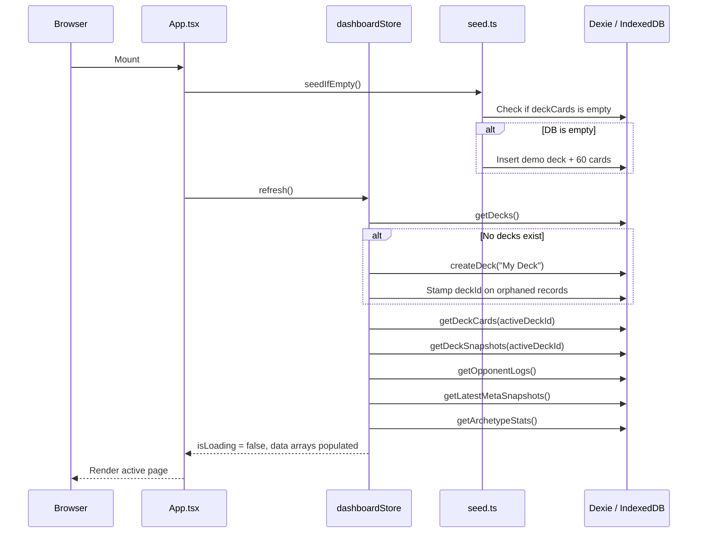
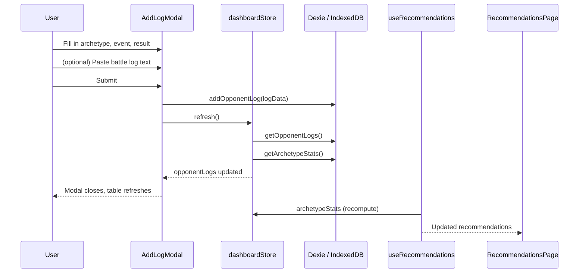
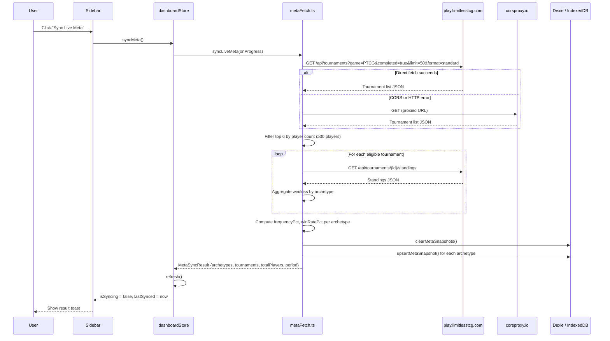
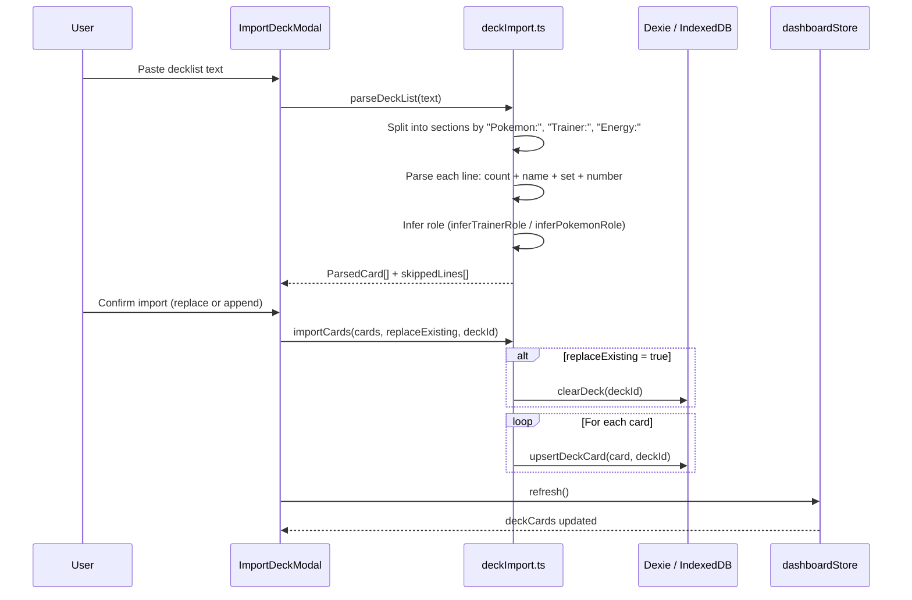
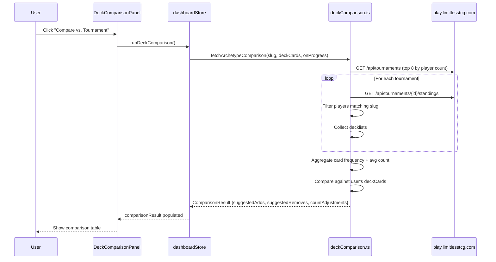
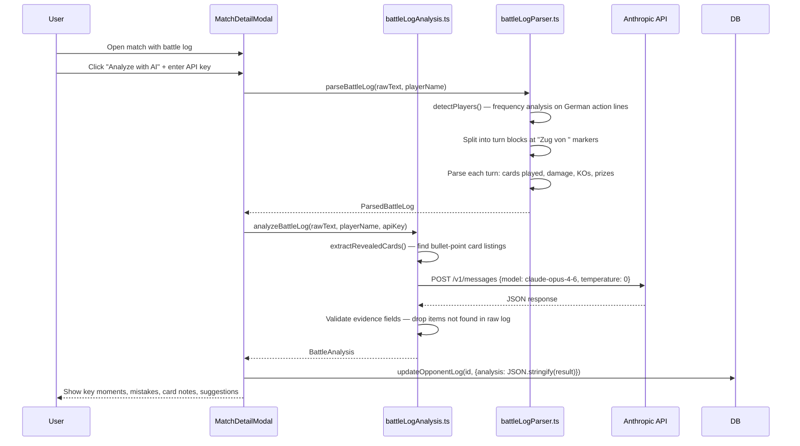
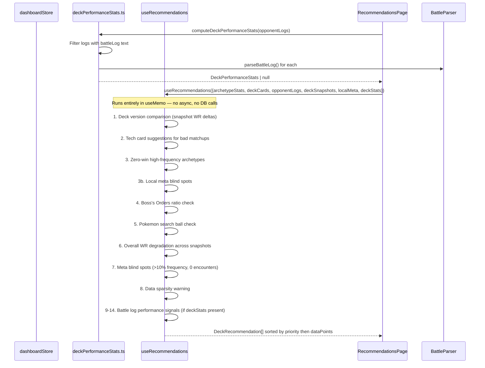
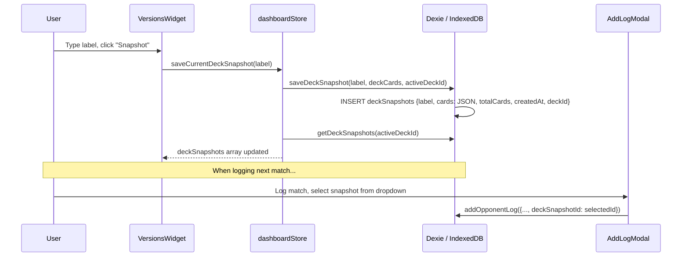
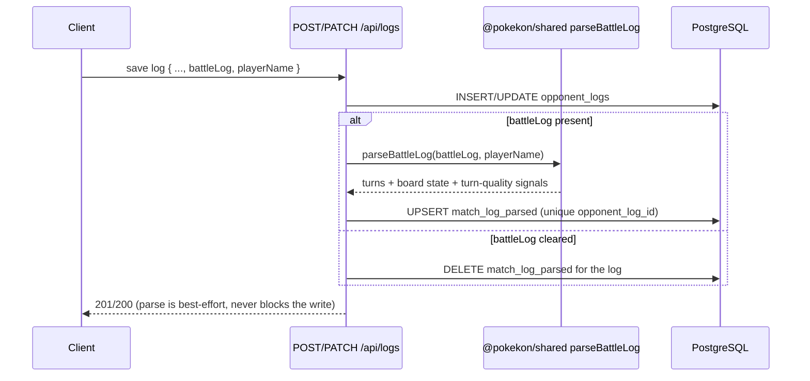
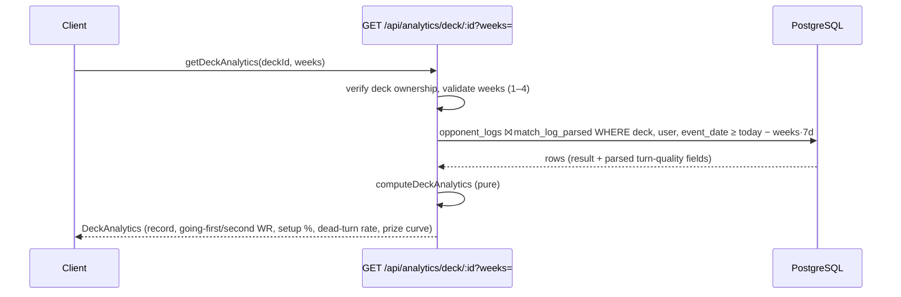

# Data Flow

This document traces how data moves through the application for each major operation.

---

## App Startup



The `refresh()` call is the single synchronization point between IndexedDB and Zustand. All pages read from the store — never directly from Dexie.

---

## User Logs a Match



After the log is written to IndexedDB, `refresh()` reloads both the raw logs and the derived `archetypeStats`. The `useRecommendations` hook in `RecommendationsPage` reacts automatically because it depends on `archetypeStats` from the store.

---

## Meta Sync (Limitless API)



The sync always clears all existing meta snapshots before writing new ones. The period label is the current ISO week (e.g., `"2026-W15"`), so re-syncing in the same week replaces the same-period rows via the compound index upsert.

---

## Deck Import (Text Paste)



The text format expected is the standard PTCG export format:
```
Pokémon: 12
4 Pikachu ex MEW 71
...
Trainer: 32
4 Professor's Research SVI 189
...
Energie: 16
8 Basic Lightning Energy SVE 4
```

Section headers are detected case-insensitively and support both English ("Energy") and German ("Energie") spellings.

---

## Deck Comparison (Tournament Lists)



The slug matching uses bidirectional substring matching: `"n-zoroark"` matches any tournament deck ID that contains `"n-zoroark"` or that `"n-zoroark"` contains. Cards appearing in fewer than 45% of tournament lists are not in `suggestedAdds` (threshold is 55%); cards the user runs that appear in fewer than 20% of lists go into `suggestedRemoves`.

---

## Battle Log Analysis (Claude AI)



The battle log protocol is in **German** (exported from Pokemon TCG Live). Turn boundaries are marked by `"Zug von "` lines. Player detection uses frequency analysis on action lines matching `"Name hat ..."` patterns, filtering out German stop-words.

---

## Recommendation Generation



The hook is a pure `useMemo` computation — no side effects, no DB calls. It recomputes whenever any of its inputs change. The 14 recommendation rules run in sequence, each appending to a shared `recs` array. Final sort: `high → medium → low`, then within each priority by `dataPoints` descending.

---

## Snapshot Save and Version Tracking



Once a match log is linked to a snapshot, the recommendation engine can compare win rates across deck versions for the same opponent archetype.

---

## Server-side Battle-Log Pipeline (parse on write)

The flows above are the browser's local-first paths. The backend (`apps/api`)
adds a **parse-on-write** pipeline (plan §4): the expensive battle-log parse
runs once when a log is saved, and the structured result is persisted so later
analytics reads never re-parse.



`playerName` pins which side is "me"; absent, the parser falls back to its
heuristic player detection. The parse step is wrapped so a parser failure logs a
warning but never fails the log write. Parsed rows cascade-delete with their
`opponent_logs` row.

## Deck Analytics Read Path



The window filter is served by the new plain `event_date` index. The aggregation
covers plan §3.7.1: going-first/second win rate, clean-setup-by-turn-2 share,
dead-turn rate, and the average remaining-prize curve of won games. The response
shape is the shared `DeckAnalytics` contract in `@pokekon/shared`.
