# Data Flow

This document traces how data moves through the application for each major operation.

---

## App Startup

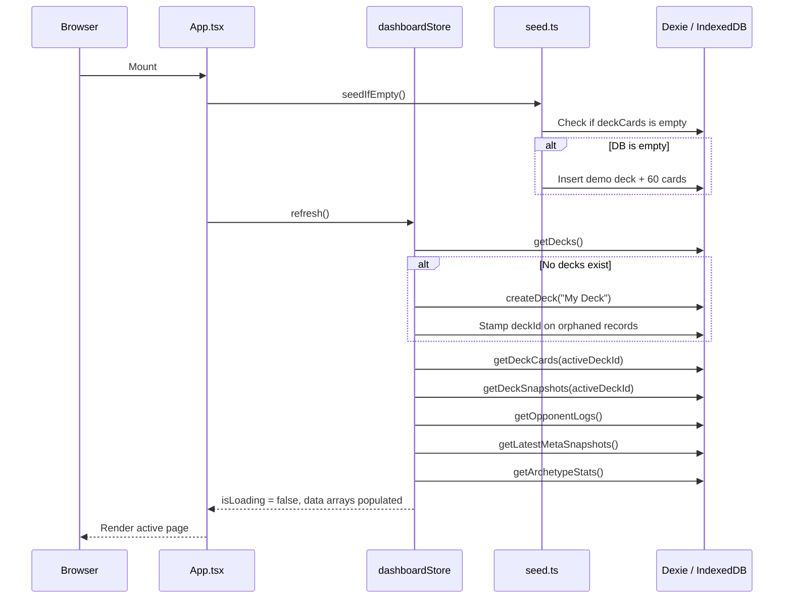

The `refresh()` call is the single synchronization point between IndexedDB and Zustand. All pages read from the store — never directly from Dexie.

---

## User Logs a Match

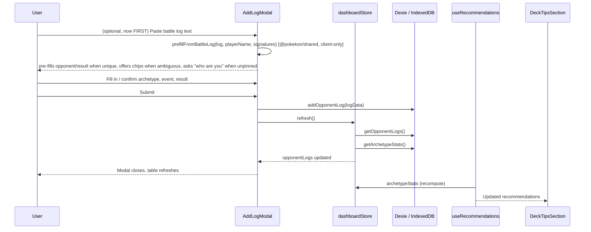

After the log is written to IndexedDB, `refresh()` reloads both the raw logs and the derived `archetypeStats`. The `useRecommendations` hook in `DeckTipsSection` reacts automatically because it depends on `archetypeStats` from the store.

**Where the pre-fill happens (plan `personal-data-role-rework.md` §3.5/§3.6):**
entirely on the client, entirely before submit — `prefillFromBattleLog` lives in
`@pokekon/shared` (no server round-trip; `parseBattleLog` was already called
client-side elsewhere, e.g. `MatchDetailModal`) and is pure: it reads the pasted
text and the `tcg-player-name` value, and returns a `BattleLogPrefill` or `null`.
**Nothing new is persisted** — the archetype/result pre-fill only sets the same
form fields a manual entry would set; the only wire change is the now-actually-sent
`playerName` (see the pipeline section below).

---

## Deck Synthesis (Spec 8 — Structured LLM Analysis)

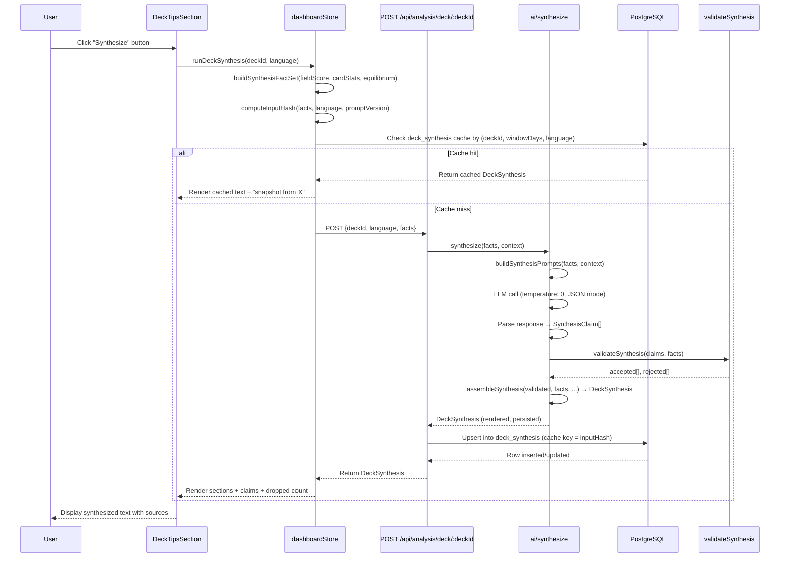

**Key differences from battle-log analysis:**
1. **No raw input:** The LLM receives a closed, structured facts list (Field-Score, matchups, card deltas, equilibrium) — not a raw battle log.
2. **Direction from band:** Each fact's direction (positive/negative/neutral) is derived from its confidence interval, not guessed by the model.
3. **No numbers from model:** Claims use placeholders (`{value}`, `{label}`) filled server-side after validation.
4. **Cache by input hash:** Text is reused until the underlying facts change; input hash is computed from the canonical facts list + language + prompt version.
5. **Snapshot semantics:** Old text persists as "snapshot from {timestamp}" with a "Re-synthesize" button, but the UI always renders the **current** numbers, never stale data.

---

## Server-side Battle-Log Pipeline (match_log_parsed)

---

## Meta Sync (Limitless API)

> **Legacy browser path.** This sync currently runs in the browser (with the `corsproxy.io` fallback shown below). It is slated to move to a server-side cron job — no CORS proxy needed — writing the shared server-side `meta_snapshots` table (see [architecture.md](./architecture.md) → *External API Integration* and [backend-evolution-plan.md](./backend-evolution-plan.md) §6.2).

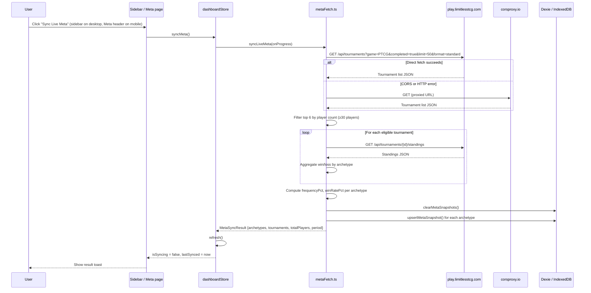

The sync always clears all existing meta snapshots before writing new ones. The period label is the current ISO week (e.g., `"2026-W15"`), so re-syncing in the same week replaces the same-period rows via the compound index upsert.

> **Note on the diagram above:** it predates the server-side sync
> (`apps/api/src/jobs/syncMeta.ts`, [features.md](./features.md) §2) and is kept
> here as a historical record of the browser-side predecessor; it does not
> reflect the current data path. Two additions the current server-side sync
> makes that are worth documenting even without redrawing the whole diagram:
> - **Ties propagate through the sync path:** `tournament_standings.ties` →
>   `recomputeCurrentPeriodSnapshots` sums them per archetype →
>   `meta_snapshots.ties` and its tie-weighted `win_rate_pct`
>   (`tournamentWinRatePct`, `@pokekon/shared`).
> - **Matchup blend + conflict flag:** `GET /api/meta/matchups` builds each
>   directed pair from `tournament_matchups` (own data) with the TrainerHill
>   CSV as a fallback for pairs without enough own games; the two sources are
>   also compared via `detectMatchupConflicts` (own vs. fallback, > 15pp with
>   own data overriding the fallback → flagged), exposed as
>   `matchupSource.conflictCount`/`conflicts` and logged server-side. The
>   displayed win rate is always the own value — a conflict never changes it.
> - **Confidence bands, computed at read time, nothing persisted (Spec 3,
>   `confidence-aware-matchups.md`):** every raw record needed for a Wilson
>   interval (`wins`/`losses`/`ties`/`total`) already lives in
>   `matchup_matrix`, `tournament_matchups` and `tournament_standings` — no
>   migration, no new column, no backfill job. `apps/api/src/routes/meta.ts`
>   passes those raw counts straight into the `MatchupCell`s it feeds
>   `computeFieldScores` (`@pokekon/shared`), which computes the band
>   (`fieldWinRateLowPct`/`HighPct`, `threats[]`/`freeWins[].lowPct/highPct/
>   significant`) fresh on every `/field-analysis` and `/archetypes/:id/analysis`
>   request. The web client repeats the same computation client-side in
>   `PredictionPanel.tsx` (it calls `computeFieldScores` directly over the
>   fetched `MatchupRow[]`) — the same pure function, not a second
>   implementation. Nothing about this is cached or written back to the
>   database; a re-request with the same inputs always recomputes the same
>   band.

---

## Deck Import (Text Paste)

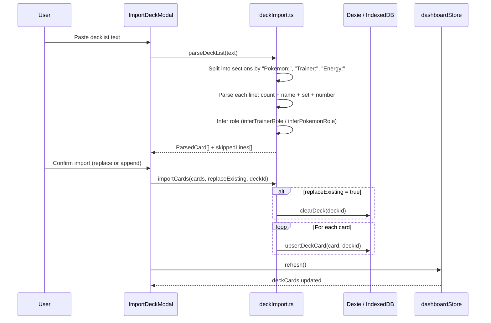

The text format expected is the standard PTCG export format:
```
Pokémon: 12
4 Pikachu ex MEW 71
...
Trainer: 32
4 Professor's Research SVI 189
...
Energie: 16
8 Basic Lightning Energy SVE 4
```

Section headers are detected case-insensitively and support both English ("Energy") and German ("Energie") spellings.

---

## Deck Comparison (Tournament Lists)

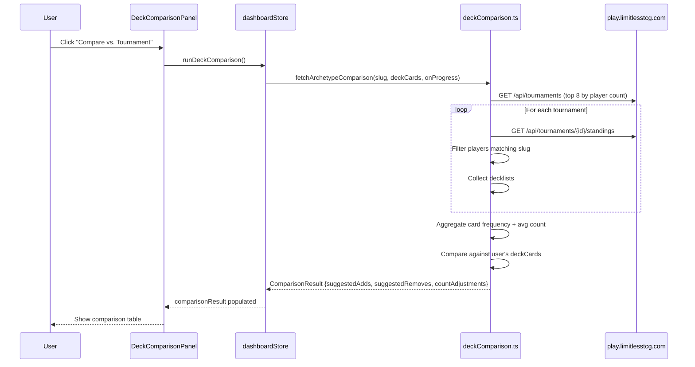

The slug matching uses bidirectional substring matching: `"n-zoroark"` matches any tournament deck ID that contains `"n-zoroark"` or that `"n-zoroark"` contains. Cards appearing in fewer than 45% of tournament lists are not in `suggestedAdds` (threshold is 55%); cards the user runs that appear in fewer than 20% of lists go into `suggestedRemoves`.

---

## Battle Log Analysis (LLM, server-side · BYOK)

The LLM analysis runs **server-side** behind a provider abstraction (plan §6.3 Phase A).
The user's API key is stored encrypted in PostgreSQL and only decrypted on the
server for the call — it never reaches the browser. The default (and currently
only) provider is **GitHub Models**. Anti-hallucination is enforced by the shared
engine: every `evidence` field must be a verbatim log quote, suggestions only for
cards shown in hand, `temperature=0`, and ungrounded items are dropped.

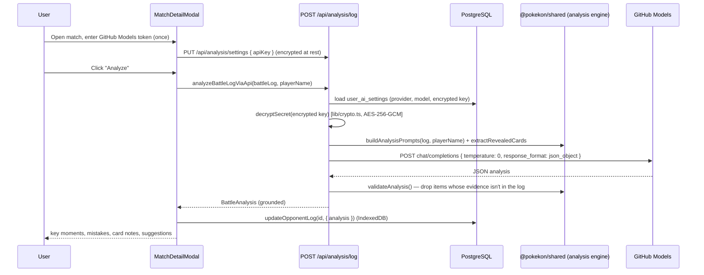

The battle log protocol is in **German** (exported from Pokémon TCG Live). Turn
boundaries are marked by `"Zug von "` lines; player detection uses frequency
analysis on `"Name hat ..."` lines, filtering German stop-words. Activation requires
the `ENCRYPTION_KEY` server variable and a per-user GitHub Models token (see
[getting-started.md](./getting-started.md)).

---

## Recommendation Generation

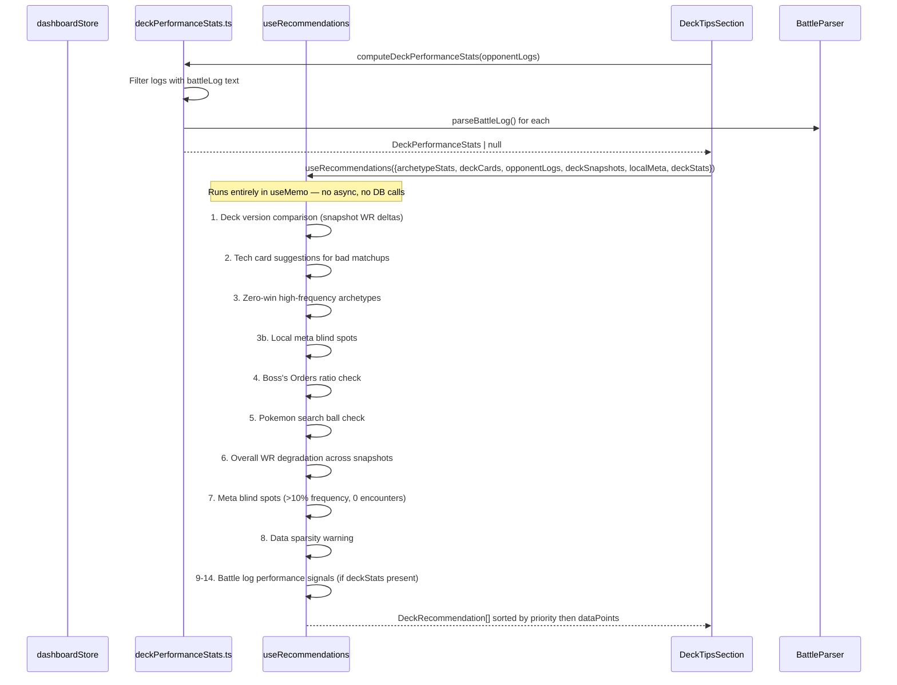

The hook is a pure `useMemo` computation — no side effects, no DB calls. It recomputes whenever any of its inputs change. The 14 recommendation rules run in sequence, each appending to a shared `recs` array. Final sort: `high → medium → low`, then within each priority by `dataPoints` descending.

---

## Snapshot Save and Version Tracking

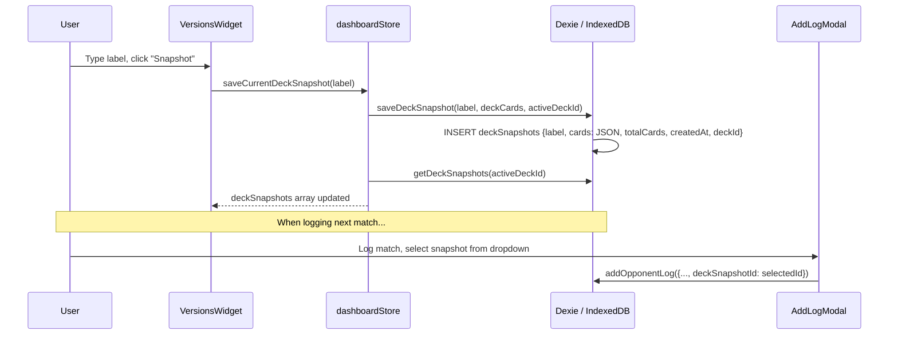

Once a match log is linked to a snapshot, the recommendation engine can compare win rates across deck versions for the same opponent archetype.

---

## Server-side Battle-Log Pipeline (parse on write)

The flows above are the browser's local-first paths. The backend (`apps/api`)
adds a **parse-on-write** pipeline (plan §4): the expensive battle-log parse
runs once when a log is saved, and the structured result is persisted so later
analytics reads never re-parse.

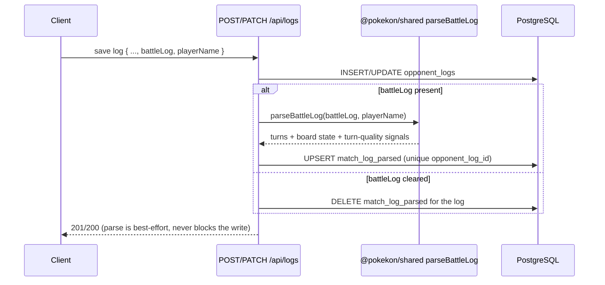

`playerName` pins which side is "me"; absent, the parser falls back to its
heuristic player detection. The parse step is wrapped so a parser failure logs a
warning but never fails the log write. Parsed rows cascade-delete with their
`opponent_logs` row.

**Fixed gap (plan `personal-data-role-rework.md` §0.6/§3.7):** the server has
accepted `playerName` on this route from the start, but `AddLogModal` never
actually sent it — `matchLogPipeline.ts` always parsed with `''`, so
`match_log_parsed.turns` could silently be attributed to the wrong side. The web
client now sends `playerName` whenever it is known (the same value stored under
`localStorage['tcg-player-name']`), omitting the field entirely otherwise. Not
re-parsed retroactively — see [database.md](./database.md).

## Card Performance Delta Precomputation (Spec 5)

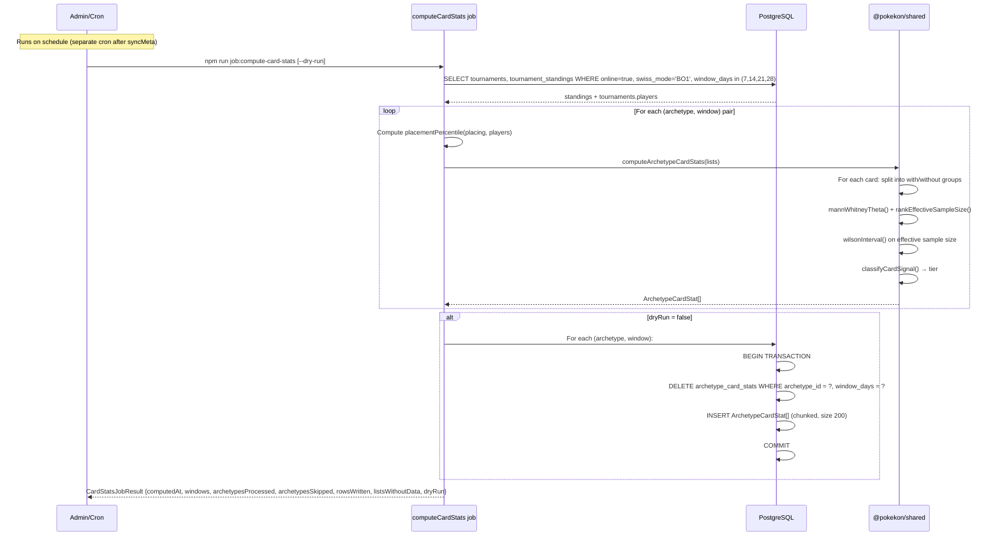

The job runs separately from `syncMeta` (no direct coupling). Both rows in a single
(archetype, window) are written atomically, guaranteeing readers never see a
partially-computed state. `computedAt` marks the point in time the run occurred;
the UI surfaces this alongside each card's delta so users understand freshness.

Archetype-window pairs with fewer than 8 usable lists are skipped entirely
(no rows written, reported in `archetypesSkipped`). Listings without `decklist`
or `placing` are dropped and tallied in `listsWithoutData`.

---

## Deck Comparison with Performance Deltas (Spec 5)

The existing deck-comparison fetch (Limitless-based) is now extended with server-side
precomputed deltas:

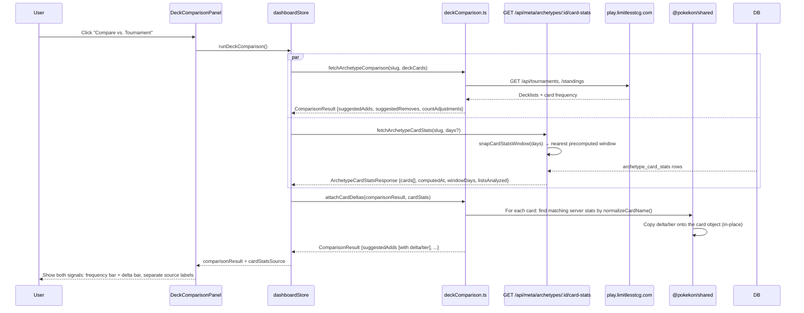

The two fetches run in parallel; if the delta-fetch fails (old server, cold start, network error),
the comparison still succeeds with `delta` and `tier` undefined on each card. The
`cardStatsSource` field documents provenance (window, `computedAt`, `listsAnalyzed`)
separately from the frequency data so both sources are always visible and distinct.

---

## Recommendation Rule 2 with Card Deltas (Spec 5)

Rule 2 (weak matchup) is enriched when card performance deltas are available:

```mermaid
sequenceDiagram
    participant Store as dashboardStore
    participant Hook as useRecommendations
    participant RecSection as DeckTipsSection

    RecSection->>Store: Read archetypeStats, deckCards, cardStats
    RecSection->>Hook: useRecommendations({..., cardDeltas: cardStats})

    Hook->>Hook: Rule 2: Weak matchup check (≥5 encounters, ≤50% WR)
    Note over Hook: If cardDeltas provided and not empty:
    Hook->>Hook: Filter cardDeltas to tier='hiddenGem' or 'confirmed'
    Hook->>Hook: Exclude cards already in deckCards (by normalizeCardName)
    Hook->>Hook: Sort by deltaPp desc, then inclusionPct desc
    Hook->>Hook: Take top 2 cards
    Hook->>Hook: Append text: "In your archetype, [Card1] (+Xpp, 95% Y–Z) and [Card2] (+Aap, 95% B–C) correlate with better placements; you play neither."
    Note over Hook: Archetype-wide correlation claim, never matchup-specific

    Hook-->>RecSection: DeckRecommendation (same priority/id/category as before, enriched reasoning)
```

The enrichment is purely textual — it does not change priority, category, or data points.
The statement is always correlational ("correlate with"), never causal ("help against" the opponent archetype).
If no qualifying cards exist, the rule produces the original reasoning (frequency-based pointer to List Comparison).

---

## Deck Analytics Read Path

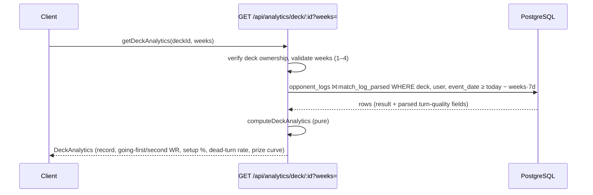

The window filter is served by the new plain `event_date` index. The aggregation
covers plan §3.7.1: going-first/second win rate, clean-setup-by-turn-2 share,
dead-turn rate, and the average remaining-prize curve of won games. The response
shape is the shared `DeckAnalytics` contract in `@pokekon/shared`.

---

## Meta Equilibrium Computation (Weekly Job)

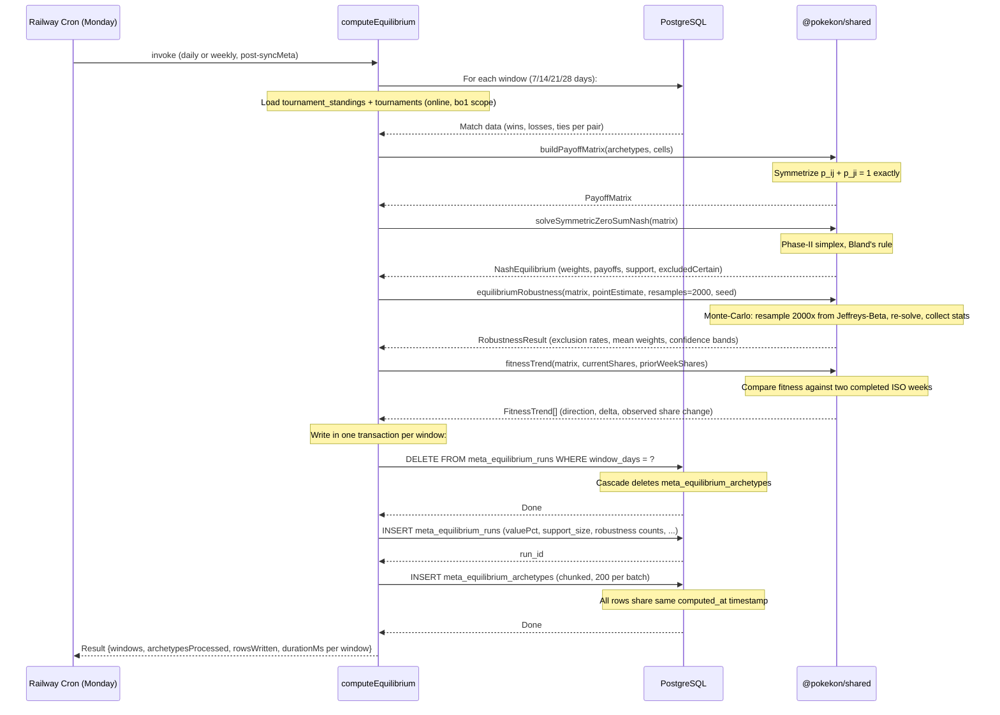

**Dry-run mode:** Executes all steps above, prints counters and durations, writes nothing to DB — safe to test against production data.

**Data sources:** The job reads `tournament_standings` joined with `tournaments` (filtering `is_online=true, swiss_mode='BO1'`), aggregates by unordered archetype pair, and invokes the pure computation functions from `@pokekon/shared`.

---

## Meta Equilibrium Read Path

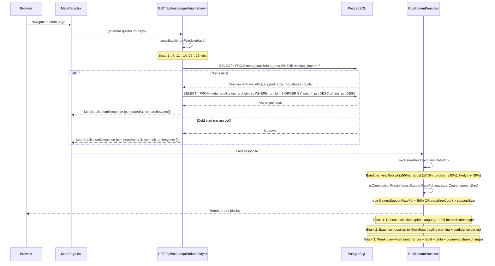

**Placement:** The section is a collapsed `CollapsibleSection` (no `defaultOpen`) on the Meta page, appearing after Field Score and Matchup Matrix. An "experimental" badge signals this is additional analysis, not a replacement.

**Cold start:** `computedAt === null` displays a neutral message ("Not yet computed") — no error, no spinner, just honest acknowledgement that the weekly job hasn't run yet.
