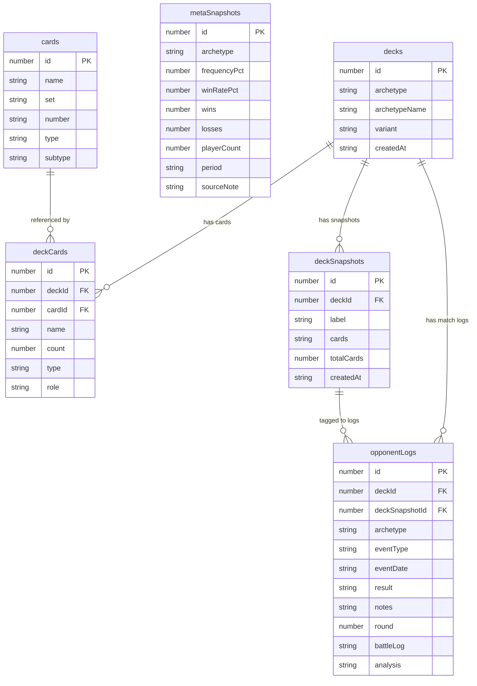

# Database Documentation

## Overview

The app uses **Dexie 4** as a typed wrapper around the browser's **IndexedDB** API. The database is named `TCGMetaDashboard` and defined in `src/db/database.ts`. All database operations are centralized in `src/db/queries.ts`.

This document covers the browser's local-first Dexie store. The app is **not** serverless — a Hono + PostgreSQL backend (`apps/api`) mirrors these domain tables and adds server-only ones (see the **Server-side schema** section below). The migration "IndexedDB → API as the source of truth" is in progress, so the local store and the server store coexist today.

---

## Current Schema (v3)

### Table: `cards`

Stores individual card definitions. Rarely used directly — card data is denormalized into `deckCards` for performance.

| Column | Type | Index | Description |
|--------|------|-------|-------------|
| `id` | number (auto) | PK | Auto-increment primary key |
| `name` | string | yes | Card name, e.g. "Professor's Research" |
| `set` | string | yes | Set code, e.g. "TWM" |
| `number` | string | no | Collector number, e.g. "189" |
| `type` | CardType | yes | `'Pokemon'` / `'Trainer'` / `'Energy'` |
| `subtype` | string | no | e.g. "Basic", "Stage 2", "Supporter" |

**Dexie index string:** `++id, name, set, type`

---

### Table: `decks`

One row per deck. Supports multiple decks (multi-deck support added in v3).

| Column | Type | Index | Description |
|--------|------|-------|-------------|
| `id` | number (auto) | PK | Auto-increment primary key |
| `archetype` | string | yes | Limitless slug, e.g. `"n-zoroark"` |
| `archetypeName` | string | no | Human-readable name, e.g. `"N's Zoroark"` |
| `variant` | string | no | Build label, e.g. `"Fezandipiti Build"` |
| `createdAt` | string | no | ISO timestamp |

**Dexie index string:** `++id, archetype`

---

### Table: `deckCards`

The actual card list for a deck. Each row is one distinct card (not one copy).

| Column | Type | Index | Description |
|--------|------|-------|-------------|
| `id` | number (auto) | PK | Auto-increment primary key |
| `deckId` | number | yes | Foreign key → `decks.id` |
| `cardId` | number | no | Foreign key → `cards.id` (often 0 when imported from text) |
| `name` | string | yes | Card name (denormalized for query performance) |
| `count` | number | no | How many copies in the deck (1–4) |
| `type` | CardType | yes | `'Pokemon'` / `'Trainer'` / `'Energy'` |
| `role` | CardRole | yes | `'attacker'` / `'supporter'` / `'item'` / `'stadium'` / `'energy'` / `'tech'` |

**Dexie index string:** `++id, deckId, cardId, name, type, role`

---

### Table: `deckSnapshots`

Point-in-time snapshots of a deck's card list. Used for version history and for tagging match logs to a specific deck version.

| Column | Type | Index | Description |
|--------|------|-------|-------------|
| `id` | number (auto) | PK | Auto-increment primary key |
| `deckId` | number | yes | Foreign key → `decks.id` |
| `label` | string | no | User-supplied label, e.g. `"Added Fezandipiti, -1 Judge"` |
| `cards` | string | no | `JSON.stringify(DeckCard[])` — full card list at snapshot time |
| `totalCards` | number | no | Card count total (convenience field) |
| `createdAt` | string | yes | ISO timestamp |

**Dexie index string:** `++id, deckId, createdAt`

The `cards` column stores the entire deck list as a JSON string. Use `parseDeckSnapshot(snap)` from `queries.ts` to deserialize.

---

### Table: `opponentLogs`

One row per match played. The core personal-data table.

| Column | Type | Index | Description |
|--------|------|-------|-------------|
| `id` | number (auto) | PK | Auto-increment primary key |
| `deckId` | number | yes | Which deck was piloted (FK → `decks.id`) |
| `archetype` | string | yes | Opponent's deck archetype, e.g. `"Dragapult ex"` |
| `eventType` | EventType | yes | `'LC'` / `'LCup'` / `'Regional'` / `'Worlds'` / `'Online'` |
| `eventDate` | string | yes | Date in `YYYY-MM-DD` format |
| `result` | MatchResult | yes | `'W'` / `'L'` / `'T'` |
| `notes` | string | no | Free-text notes |
| `round` | number? | no | Round number within the event (optional) |
| `deckSnapshotId` | number? | yes | Which deck snapshot was active (optional) |
| `battleLog` | string? | no | Raw German battle protocol text from TCG Live (optional) |
| `analysis` | string? | no | `JSON.stringify(BattleAnalysis)` — server-side LLM battle-log analysis (optional) |

**Dexie index string:** `++id, deckId, archetype, eventType, eventDate, result, deckSnapshotId`

---

### Table: `metaSnapshots`

Tournament meta data aggregated from Limitless. One row per archetype per week.

| Column | Type | Index | Description |
|--------|------|-------|-------------|
| `id` | number (auto) | PK | Auto-increment primary key |
| `archetype` | string | yes, compound | Deck archetype display name |
| `frequencyPct` | number | no | Percentage of players running this archetype (0–100) |
| `winRatePct` | number | no | Tournament win rate (0–100) |
| `wins` | number | no | Raw win count across all fetched tournaments |
| `losses` | number | no | Raw loss count |
| `playerCount` | number | no | How many players ran this archetype |
| `period` | string | yes, compound | ISO week label, e.g. `"2026-W15"` |
| `sourceNote` | string | no | Human-readable sync info, e.g. `"Limitless TCG · 6 tournaments · 842 players"` |

**Dexie index string:** `++id, [archetype+period], archetype, period`

The compound index `[archetype+period]` enables efficient upsert lookups: `upsertMetaSnapshot` uses `.where('[archetype+period]').equals([snap.archetype, snap.period])` to avoid duplicates.

---

## Entity Relationship Diagram

---

## Migration History

### v1 — Initial schema
Tables: `cards`, `deckCards`, `opponentLogs`, `metaSnapshots`. No deck entity — deckCards are global. No `deckSnapshots` table.

### v2 — Deck snapshots added
Added `deckSnapshots` table with `createdAt` index. Added `deckSnapshotId` column to `opponentLogs` to allow tagging a match to a specific deck version. No upgrade migration needed for existing rows.

### v3 — Multi-deck support (current)
Added `decks` table. All per-deck tables (`deckCards`, `deckSnapshots`, `opponentLogs`) gained a `deckId` foreign key column and corresponding index.

**Upgrade migration (v2 → v3):** The upgrade function:
1. Creates a default `decks` row with `id: 1`, archetype `"my-deck"`, archetypeName `"My Deck"`.
2. Stamps `deckId: 1` on all existing `deckCards`, `deckSnapshots`, and `opponentLogs` records.

Uses Promise chaining (not async/await) to stay within the IndexedDB transaction microtask constraint.

**Safety net in `dashboardStore.refresh()`:** If at app startup no decks exist despite card or log data being present (e.g., failed migration or legacy data), the store automatically creates a default deck and re-associates all un-tagged records.

---

## Key Query Patterns

### Upsert (meta sync)
`upsertMetaSnapshot` uses the compound index `[archetype+period]` to find an existing row before deciding to `update` or `add`. This prevents duplicate meta entries across multiple syncs in the same week.

### Cascading delete
`deleteDeck(id)` runs a Dexie transaction across four tables to remove the deck and all associated `deckCards`, `deckSnapshots`, and `opponentLogs` atomically.

### Derived stats
`getArchetypeStats()` and `getDeckVariantStats()` are computed from raw `opponentLogs` and `metaSnapshots` entirely in JavaScript — there are no SQL aggregation queries. This is intentional: Dexie's IndexedDB abstraction does not support JOINs or GROUP BY.

### Snapshot parsing
Snapshots store the card list as a JSON string. `parseDeckSnapshot(snap)` safely deserializes it and returns an empty array on parse failure.

---

## Server-side schema (apps/api · PostgreSQL via Drizzle)

The sections above describe the browser's Dexie/IndexedDB store. The backend
(`apps/api`) mirrors the domain tables in PostgreSQL and adds tables the client
never had. The two relevant to the battle-log pipeline (Baustein B):

### Table: `match_log_parsed`

One row per `opponent_logs` row that has a battle log. The parse runs **once on
write** (see [data-flow.md](./data-flow.md) → *Server-side Battle-Log Pipeline*);
read queries hit these finished aggregates instead of re-parsing.

| Column | Type | Notes |
|--------|------|-------|
| `id` | serial PK | |
| `opponent_log_id` | int FK → `opponent_logs.id`, **unique** | `onDelete: cascade` |
| `user_id` | text FK → `user.id` | indexed |
| `total_turns` | int | |
| `went_first` | boolean (nullable) | null when undeterminable |
| `turns` | jsonb | `ParsedTurn[]` incl. board state (active/bench/handSize/supporters/energyInPlay) |
| `prize_progression` | jsonb | `PrizePoint[]` |
| `parser_version` | int | bump → selective re-parse (`PARSER_VERSION` in `@pokekon/shared`) |
| `setup_clean_by_turn2` | boolean | materialised turn-quality field |
| `dead_turns` | int | materialised turn-quality field |
| `created_at` | timestamptz | |

### Table: `meta_snapshots` (server)

The server-side counterpart of the IndexedDB `metaSnapshots` table — **global**
(not user-scoped), so the meta sync produces one shared view for all users.
Columns mirror the client shape (`archetype`, `frequency_pct`, `win_rate_pct`
nullable, `wins`, `losses`, `ties` (integer, `NOT NULL DEFAULT 0`, migration
`0010`), `player_count`, `period`, `source_note`, `created_at`) with a unique
index on `(period, archetype)` and an `archetype` index. `archetype_id`
(nullable) holds the Limitless deck slug — the join key for the archetype
drilldown; rows synced before the column existed carry null until the next
sync backfills them. `win_rate_pct` uses the official tournament formula (a
tie counts as a third of a win, `tournamentWinRatePct` in `@pokekon/shared`)
and is `null` only when there were no games at all in the period — **not**
when there were no decisive games (a semantic change from the earlier
`wins/(wins+losses)`, plan §6 risk 3). Rows synced before this change keep
their old value until touched by `job:backfill-winrates` (see
[features.md](./features.md) §2).

### Tables: `tournaments` + `tournament_standings` (raw Limitless data, plan §5.2)

The meta sync persists what Limitless served instead of only aggregating, so
decklists, time-window analyses and (later) an own matchup matrix never need a
re-fetch. Both are global reference data.

| `tournaments` column | Type | Notes |
|--------|------|-------|
| `id` | text PK | Limitless tournament id |
| `name` / `date` / `players` / `format` | text / timestamptz / int / text | |
| `is_online` | boolean | ground-truth from Limitless `/details` (`classifyTournamentDetails`); name heuristic only as a fallback |
| `platform` | text (nullable) | e.g. `"PTCGL"`, from `/details` |
| `swiss_mode` | text (nullable) | Swiss-phase format `BO1`/`BO3`/`OTHER` from `/details`; the online-Bo1 meta reads filter `is_online AND swiss_mode = 'BO1'` (migration 0006) |
| `fetched_at` | timestamptz | |

| `tournament_standings` column | Type | Notes |
|--------|------|-------|
| `id` | serial PK | |
| `tournament_id` | text FK → `tournaments.id` | `onDelete: cascade`, indexed |
| `archetype_id` / `archetype_name` | text | Limitless deck slug (`'other'` when unknown) + display name; slug indexed |
| `player_name` | text (nullable) | capped at 100 chars on ingest |
| `placing` | int (nullable) | null for drops |
| `wins` / `losses` / `ties` | int | |
| `decklist` | jsonb (nullable) | `TournamentDecklist`, **pruned on ingest** (`pruneDecklist`: field whitelist, length caps, count clamps) |

### Table: `matchup_matrix`

The TrainerHill head-to-head export, structured (plan §5.2). Rows sharing one
`imported_at` form a batch; reads always use the latest batch (older imports
remain as history). Seeded lazily from the CSV bundled at `apps/api/data/`
when the table is empty; updated via `POST /api/matchups/import` or the
`importMatchups` job. `win_rate` is directional (deck1's perspective).

### Indexes for time-window analytics

`opponent_logs` gains a plain `event_date` index (alongside the existing
`(archetype, event_date)` compound) to serve the parametrised 1/2/3/4-week
analytics queries.

### Column: `opponent_logs.best_of` (migration `0011`)

`text` enum (`BEST_OF_VALUES` in `@pokekon/shared`: `'BO1' | 'BO3'`), nullable
+ a `CHECK` constraint (`best_of IN ('BO1','BO3')`, NULL always passes).
`NULL` = "format unknown" — the state of every row written before this column
existed; it is never silently mapped to a default. Required (hard 400 without
it) on `POST /api/logs`; `PATCH /api/logs/:id` may set it but never reset it
back to `NULL`. Drives the Bo1-equivalent personal win rate
(`bo1EquivalentWinRate`, `@pokekon/shared`) — see
[features.md](./features.md) §1/§6.

### Table: `user_ai_settings`

Per-user LLM-analysis settings (BYOK). The API key is stored **AES-256-GCM
encrypted** (`apps/api/src/lib/crypto.ts`, server key from `ENCRYPTION_KEY`) and
is only decrypted server-side for the analysis call — never returned to clients.

| Column | Type | Notes |
|--------|------|-------|
| `user_id` | text PK FK → `user.id` | one settings row per user, `onDelete: cascade` |
| `provider` | text | default `github-models` (only adapter today) |
| `model` | text (nullable) | null → adapter default (`openai/gpt-4.1`) |
| `encrypted_api_key` | text (nullable) | `v1:iv:tag:ciphertext`; null → no key configured |
| `created_at` / `updated_at` | timestamptz | |

### Migrations

Generated with `npm run db:generate -w @pokekon/api`: `0002_*` adds
`match_log_parsed` + `meta_snapshots` + the `event_date` index; `0003_*` adds
`user_ai_settings`; `0005_*` adds `tournaments`, `tournament_standings`,
`matchup_matrix` and `meta_snapshots.archetype_id`; `0010_*` adds
`meta_snapshots.ties`; `0011_*` adds `opponent_logs.best_of` + its `CHECK`
constraint. Both `0010` and `0011` are purely additive (new nullable/defaulted
columns, no rewrite of existing rows) so they are safe to apply before the
matching code deploys (plan §5). The PGlite test harness applies the real
migration SQL, so the generated schema is exercised in CI.
