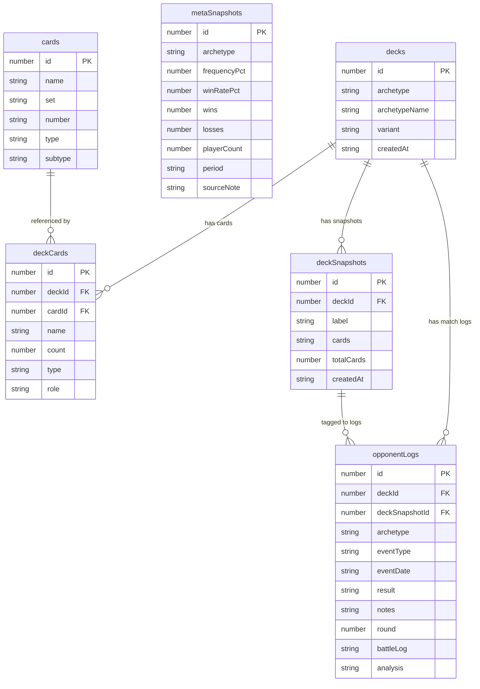

# Database Documentation

## Overview

The app uses **Dexie 4** as a typed wrapper around the browser's **IndexedDB** API. The database is named `TCGMetaDashboard` and defined in `src/db/database.ts`. All database operations are centralized in `src/db/queries.ts`.

This document covers the browser's local-first Dexie store. The app is **not** serverless — a Hono + PostgreSQL backend (`apps/api`) mirrors these domain tables and adds server-only ones (see the **Server-side schema** section below). The migration "IndexedDB → API as the source of truth" is in progress, so the local store and the server store coexist today.

---

## Current Schema (v3)

### Table: `cards`

Stores individual card definitions. Rarely used directly — card data is denormalized into `deckCards` for performance.

| Column | Type | Index | Description |
|--------|------|-------|-------------|
| `id` | number (auto) | PK | Auto-increment primary key |
| `name` | string | yes | Card name, e.g. "Professor's Research" |
| `set` | string | yes | Set code, e.g. "TWM" |
| `number` | string | no | Collector number, e.g. "189" |
| `type` | CardType | yes | `'Pokemon'` / `'Trainer'` / `'Energy'` |
| `subtype` | string | no | e.g. "Basic", "Stage 2", "Supporter" |

**Dexie index string:** `++id, name, set, type`

---

### Table: `decks`

One row per deck. Supports multiple decks (multi-deck support added in v3).

| Column | Type | Index | Description |
|--------|------|-------|-------------|
| `id` | number (auto) | PK | Auto-increment primary key |
| `archetype` | string | yes | Limitless slug, e.g. `"n-zoroark"` |
| `archetypeName` | string | no | Human-readable name, e.g. `"N's Zoroark"` |
| `variant` | string | no | Build label, e.g. `"Fezandipiti Build"` |
| `createdAt` | string | no | ISO timestamp |

**Dexie index string:** `++id, archetype`

---

### Table: `deckCards`

The actual card list for a deck. Each row is one distinct card (not one copy).

| Column | Type | Index | Description |
|--------|------|-------|-------------|
| `id` | number (auto) | PK | Auto-increment primary key |
| `deckId` | number | yes | Foreign key → `decks.id` |
| `cardId` | number | no | Foreign key → `cards.id` (often 0 when imported from text) |
| `name` | string | yes | Card name (denormalized for query performance) |
| `count` | number | no | How many copies in the deck (1–4) |
| `type` | CardType | yes | `'Pokemon'` / `'Trainer'` / `'Energy'` |
| `role` | CardRole | yes | `'attacker'` / `'supporter'` / `'item'` / `'stadium'` / `'energy'` / `'tech'` |

**Dexie index string:** `++id, deckId, cardId, name, type, role`

---

### Table: `deckSnapshots`

Point-in-time snapshots of a deck's card list. Used for version history and for tagging match logs to a specific deck version.

| Column | Type | Index | Description |
|--------|------|-------|-------------|
| `id` | number (auto) | PK | Auto-increment primary key |
| `deckId` | number | yes | Foreign key → `decks.id` |
| `label` | string | no | User-supplied label, e.g. `"Added Fezandipiti, -1 Judge"` |
| `cards` | string | no | `JSON.stringify(DeckCard[])` — full card list at snapshot time |
| `totalCards` | number | no | Card count total (convenience field) |
| `createdAt` | string | yes | ISO timestamp |

**Dexie index string:** `++id, deckId, createdAt`

The `cards` column stores the entire deck list as a JSON string. Use `parseDeckSnapshot(snap)` from `queries.ts` to deserialize.

---

### Table: `opponentLogs`

One row per match played. The core personal-data table.

| Column | Type | Index | Description |
|--------|------|-------|-------------|
| `id` | number (auto) | PK | Auto-increment primary key |
| `deckId` | number | yes | Which deck was piloted (FK → `decks.id`) |
| `archetype` | string | yes | Opponent's deck archetype, e.g. `"Dragapult ex"` |
| `eventType` | EventType | yes | `'LC'` / `'LCup'` / `'Regional'` / `'Worlds'` / `'Online'` |
| `eventDate` | string | yes | Date in `YYYY-MM-DD` format |
| `result` | MatchResult | yes | `'W'` / `'L'` / `'T'` |
| `notes` | string | no | Free-text notes |
| `round` | number? | no | Round number within the event (optional) |
| `deckSnapshotId` | number? | yes | Which deck snapshot was active (optional) |
| `battleLog` | string? | no | Raw German battle protocol text from TCG Live (optional) |
| `analysis` | string? | no | `JSON.stringify(BattleAnalysis)` — server-side LLM battle-log analysis (optional) |

**Dexie index string:** `++id, deckId, archetype, eventType, eventDate, result, deckSnapshotId`

---

### Table: `metaSnapshots`

Tournament meta data aggregated from Limitless. One row per archetype per week.

| Column | Type | Index | Description |
|--------|------|-------|-------------|
| `id` | number (auto) | PK | Auto-increment primary key |
| `archetype` | string | yes, compound | Deck archetype display name |
| `frequencyPct` | number | no | Percentage of players running this archetype (0–100) |
| `winRatePct` | number | no | Tournament win rate (0–100) |
| `wins` | number | no | Raw win count across all fetched tournaments |
| `losses` | number | no | Raw loss count |
| `playerCount` | number | no | How many players ran this archetype |
| `period` | string | yes, compound | ISO week label, e.g. `"2026-W15"` |
| `sourceNote` | string | no | Human-readable sync info, e.g. `"Limitless TCG · 6 tournaments · 842 players"` |

**Dexie index string:** `++id, [archetype+period], archetype, period`

The compound index `[archetype+period]` enables efficient upsert lookups: `upsertMetaSnapshot` uses `.where('[archetype+period]').equals([snap.archetype, snap.period])` to avoid duplicates.

---

## Entity Relationship Diagram



---

## Migration History

### v1 — Initial schema
Tables: `cards`, `deckCards`, `opponentLogs`, `metaSnapshots`. No deck entity — deckCards are global. No `deckSnapshots` table.

### v2 — Deck snapshots added
Added `deckSnapshots` table with `createdAt` index. Added `deckSnapshotId` column to `opponentLogs` to allow tagging a match to a specific deck version. No upgrade migration needed for existing rows.

### v3 — Multi-deck support (current)
Added `decks` table. All per-deck tables (`deckCards`, `deckSnapshots`, `opponentLogs`) gained a `deckId` foreign key column and corresponding index.

**Upgrade migration (v2 → v3):** The upgrade function:
1. Creates a default `decks` row with `id: 1`, archetype `"my-deck"`, archetypeName `"My Deck"`.
2. Stamps `deckId: 1` on all existing `deckCards`, `deckSnapshots`, and `opponentLogs` records.

Uses Promise chaining (not async/await) to stay within the IndexedDB transaction microtask constraint.

**Safety net in `dashboardStore.refresh()`:** If at app startup no decks exist despite card or log data being present (e.g., failed migration or legacy data), the store automatically creates a default deck and re-associates all un-tagged records.

---

## Key Query Patterns

### Upsert (meta sync)
`upsertMetaSnapshot` uses the compound index `[archetype+period]` to find an existing row before deciding to `update` or `add`. This prevents duplicate meta entries across multiple syncs in the same week.

### Cascading delete
`deleteDeck(id)` runs a Dexie transaction across four tables to remove the deck and all associated `deckCards`, `deckSnapshots`, and `opponentLogs` atomically.

### Derived stats
`getArchetypeStats()` and `getDeckVariantStats()` are computed from raw `opponentLogs` and `metaSnapshots` entirely in JavaScript — there are no SQL aggregation queries. This is intentional: Dexie's IndexedDB abstraction does not support JOINs or GROUP BY.

### Snapshot parsing
Snapshots store the card list as a JSON string. `parseDeckSnapshot(snap)` safely deserializes it and returns an empty array on parse failure.

---

## Server-side schema (apps/api · PostgreSQL via Drizzle)

The sections above describe the browser's Dexie/IndexedDB store. The backend
(`apps/api`) mirrors the domain tables in PostgreSQL and adds tables the client
never had. The two relevant to the battle-log pipeline (Baustein B):

### Table: `match_log_parsed`

One row per `opponent_logs` row that has a battle log. The parse runs **once on
write** (see [data-flow.md](./data-flow.md) → *Server-side Battle-Log Pipeline*);
read queries hit these finished aggregates instead of re-parsing.

| Column | Type | Notes |
|--------|------|-------|
| `id` | serial PK | |
| `opponent_log_id` | int FK → `opponent_logs.id`, **unique** | `onDelete: cascade` |
| `user_id` | text FK → `user.id` | indexed |
| `total_turns` | int | |
| `went_first` | boolean (nullable) | null when undeterminable |
| `turns` | jsonb | `ParsedTurn[]` incl. board state (active/bench/handSize/supporters/energyInPlay) |
| `prize_progression` | jsonb | `PrizePoint[]` |
| `parser_version` | int | bump → selective re-parse (`PARSER_VERSION` in `@pokekon/shared`) |
| `setup_clean_by_turn2` | boolean | materialised turn-quality field |
| `dead_turns` | int | materialised turn-quality field |
| `created_at` | timestamptz | |

**`playerName` fix is not retroactive (plan `personal-data-role-rework.md` §0.6/§5
decision 4):** the web client only started sending `playerName` on log create with
this feature — rows written before it can still have `turns` attributed to the
heuristically-guessed side rather than the correct one. No backfill/re-parse job
was added for this (the `parser_version` mechanism above exists and would make one
possible, but it is deliberately out of scope here — a genuine re-parse would need
a stored, verified `playerName` per historical row, which most rows never had).

### Table: `meta_snapshots` (server)

The server-side counterpart of the IndexedDB `metaSnapshots` table — **global**
(not user-scoped), so the meta sync produces one shared view for all users.
Columns mirror the client shape (`archetype`, `frequency_pct`, `win_rate_pct`
nullable, `wins`, `losses`, `ties` (integer, `NOT NULL DEFAULT 0`, migration
`0010`), `player_count`, `period`, `source_note`, `created_at`) with a unique
index on `(period, archetype)` and an `archetype` index. `archetype_id`
(nullable) holds the Limitless deck slug — the join key for the archetype
drilldown; rows synced before the column existed carry null until the next
sync backfills them. `win_rate_pct` uses the official tournament formula (a
tie counts as a third of a win, `tournamentWinRatePct` in `@pokekon/shared`)
and is `null` only when there were no games at all in the period — **not**
when there were no decisive games (a semantic change from the earlier
`wins/(wins+losses)`, plan §6 risk 3). Rows synced before this change keep
their old value until touched by `job:backfill-winrates` (see
[features.md](./features.md) §2).

### Tables: `tournaments` + `tournament_standings` (raw Limitless data, plan §5.2)

The meta sync persists what Limitless served instead of only aggregating, so
decklists, time-window analyses and (later) an own matchup matrix never need a
re-fetch. Both are global reference data.

| `tournaments` column | Type | Notes |
|--------|------|-------|
| `id` | text PK | Limitless tournament id |
| `name` / `date` / `players` / `format` | text / timestamptz / int / text | |
| `is_online` | boolean | ground-truth from Limitless `/details` (`classifyTournamentDetails`); name heuristic only as a fallback |
| `platform` | text (nullable) | e.g. `"PTCGL"`, from `/details` |
| `swiss_mode` | text (nullable) | Swiss-phase format `BO1`/`BO3`/`OTHER` from `/details`; the online-Bo1 meta reads filter `is_online AND swiss_mode = 'BO1'` (migration 0006) |
| `fetched_at` | timestamptz | |

| `tournament_standings` column | Type | Notes |
|--------|------|-------|
| `id` | serial PK | |
| `tournament_id` | text FK → `tournaments.id` | `onDelete: cascade`, indexed |
| `archetype_id` / `archetype_name` | text | Limitless deck slug (`'other'` when unknown) + display name; slug indexed |
| `player_name` | text (nullable) | capped at 100 chars on ingest |
| `placing` | int (nullable) | null for drops |
| `wins` / `losses` / `ties` | int | |
| `decklist` | jsonb (nullable) | `TournamentDecklist`, **pruned on ingest** (`pruneDecklist`: field whitelist, length caps, count clamps) |

### Table: `matchup_matrix`

The TrainerHill head-to-head export, structured (plan §5.2). Rows sharing one
`imported_at` form a batch; reads always use the latest batch (older imports
remain as history). Seeded lazily from the CSV bundled at `apps/api/data/`
when the table is empty; updated via `POST /api/matchups/import` or the
`importMatchups` job. `win_rate` is directional (deck1's perspective).

**Spec 3 (confidence-aware matchups) deliberately adds no column here or
anywhere else.** Its 95 % Wilson confidence bands are computed at read time
from the `wins`/`losses`/`ties`/`total` already stored in this table,
`tournament_matchups` and `tournament_standings` — nothing new is persisted,
so don't go looking for a `low_pct`/`high_pct` column.

### Indexes for time-window analytics

`opponent_logs` gains a plain `event_date` index (alongside the existing
`(archetype, event_date)` compound) to serve the parametrised 1/2/3/4-week
analytics queries.

### Column: `opponent_logs.best_of` (migration `0011`)

`text` enum (`BEST_OF_VALUES` in `@pokekon/shared`: `'BO1' | 'BO3'`), nullable
+ a `CHECK` constraint (`best_of IN ('BO1','BO3')`, NULL always passes).
`NULL` = "format unknown" — the state of every row written before this column
existed; it is never silently mapped to a default. Required (hard 400 without
it) on `POST /api/logs`; `PATCH /api/logs/:id` may set it but never reset it
back to `NULL`. The sole exception is `POST /api/logs/import` (used only by
`localImport.ts`'s one-time legacy-Dexie migration), which requires an
*explicit* `bestOf: null` for logs that genuinely predate the field — never a
guessed default. Drives the Bo1-equivalent personal win rate
(`bo1EquivalentWinRate`, `@pokekon/shared`) — see
[features.md](./features.md) §1/§6.

### Table: `legacy_import_state` (migration `0012`, security review addendum)

`user_id` (PK, FK → `user.id`, `onDelete: cascade`) + `imported_at`
(timestamptz, default `now()`). A row's mere presence means "this account has
already run the legacy-Dexie import". Without this, `bestOf: null` (otherwise
impossible to write via the API) would be a permanently open second path
around the hard-required-on-create guarantee, not a one-time migration
exception. Same per-user companion-table shape as `user_ai_settings` above.

`POST /api/logs/import` **claims** this row FIRST, inside one
`db.transaction(...)` together with the ownership checks and the batch
insert: `INSERT ... ON CONFLICT (user_id) DO NOTHING RETURNING` — 0 rows back
means already-imported (or lost a race against a concurrent call for the
same account) and rolls the whole transaction back with `409`, before a
single log is written. A check-then-insert-at-the-end version of this route
had a real, deliberately-triggerable race (N concurrent requests all pass a
pre-check `SELECT` before any of them commits the flag, so all of them write
their full batch); claim-first-in-one-transaction closes that and gives the
batch atomicity for free (a failure partway through rolls back everything,
so a retry never duplicates).

### Table: `archetype_card_stats` (migration `0013`, Spec 5 precomputed deltas)

Precomputed card performance deltas per archetype per analysis window, filled by
the `computeCardStats` job (see section below). One row per distinct card per
archetype per window.

| Column | Type | Notes |
|--------|------|-------|
| `id` | serial PK | |
| `archetype_id` | text | Limitless archetype slug |
| `card_key` | text | `normalizeCardName()` key for matching across sources |
| `card_name` | text | Display spelling from the original tournament list |
| `card_type` | text | `'pokemon'` / `'trainer'` / `'energy'` |
| `window_days` | int | Analysis window: 7, 14, 21, or 28 |
| `lists_analyzed` | int | Total lists with usable placement percentile in the window |
| `lists_with` | int | How many of those include this card |
| `inclusion_pct` | real | `lists_with / lists_analyzed × 100`, 1 decimal |
| `avg_count` | real | Mean copies among including lists, 1 decimal |
| `superiority_pct` | real (nullable) | Mann-Whitney θ × 100, 1 decimal; null if a group was empty |
| `delta_pp` | real (nullable) | `superiority_pct − 50`, the headline delta in pp |
| `low_pct`, `high_pct` | real (nullable) | 95% Wilson confidence band on θ, 1 decimal |
| `effective_n` | real (nullable) | Effective sample size `3·n1·n2/(n1+n2+1)`, 2 decimals |
| `mean_percentile_with_pct`, `mean_percentile_without_pct` | real (nullable) | Mean placement percentile × 100 per group, descriptive only, 1 decimal |
| `significant` | boolean | Band excludes 50% (computed on unrounded bounds) |
| `tier` | text | Signal classification: `'confirmed'` / `'hiddenGem'` / `'popularityParadox'` / `'discouraged'` / `'neutral'` / `'insufficient'` |
| `computed_at` | timestamptz | Job run timestamp (same for all rows in a job run) |

**Indexes:**
- Unique index on `(archetype_id, card_key, window_days)` — no duplicate aggregations
- Lookup index on `(archetype_id, window_days)` — efficient fetch for a drilldown

**Check constraint:** `card_type IN ('pokemon','trainer','energy')`

### Job: `computeCardStats`

Reads all tournament lists in the online-Bo1 scope from `tournaments` + `tournament_standings`
for a given window (7/14/21/28 days), groups by archetype, and computes `ArchetypeCardStat`
for each distinct card. Runs via `npm run job:compute-card-stats -w @pokekon/api`
[--dry-run] [--windows 7,14,21,28].

**Process:**
1. For each window: fetch `tournament_standings` joined with `tournaments` (online-Bo1 scope only)
2. Compute `placementPercentile(placing, tournaments.players)` per standing; drop rows where it's null
3. Group by `archetype_id`, skip `'other'` archetype (not a playable deck)
4. Within each archetype, call `computeArchetypeCardStats()` (from `packages/shared`, pure computation)
5. For each computed card, normalize the card name via `normalizeCardName()` and split all delta fields
6. **Write in a transaction per (archetype, window) pair:** `DELETE WHERE archetype_id = ? AND window_days = ?`, then chunked `INSERT` (chunk size 200), all under `db.transaction()`
7. All rows in a run share the same `computed_at` timestamp

**Skips:**
- Archetypes with fewer than `minLists` (default 8) usable listings — threshold is job economy (prevents filling the table with "insufficient" rows), not a model cutoff
- Standings without a `decklist` or without `placing`
- Archetype `'other'` (unclassified)

**Dry-run mode:** Executes steps 1–5, prints counters, writes nothing; safe to run against production data.

**Result object:**
```
{
  computedAt: string (ISO),
  windows: number[],
  archetypesProcessed: number,
  archetypesSkipped: number,  // < minLists
  rowsWritten: number,
  listsWithoutData: number,   // no placing or decklist
  dryRun: boolean
}
```

### Migrations

Migration `0013` (generated by `npm run db:generate -w @pokekon/api`) adds the `archetype_card_stats`
table. Rein additiv (new table, no ALTER of existing tables, no drops). Safe to apply before code deploy.

### Table: `user_ai_settings`

Per-user LLM-analysis settings (BYOK). The API key is stored **AES-256-GCM
encrypted** (`apps/api/src/lib/crypto.ts`, server key from `ENCRYPTION_KEY`) and
is only decrypted server-side for the analysis call — never returned to clients.

| Column | Type | Notes |
|--------|------|-------|
| `user_id` | text PK FK → `user.id` | one settings row per user, `onDelete: cascade` |
| `provider` | text | default `github-models` (only adapter today) |
| `model` | text (nullable) | null → adapter default (`openai/gpt-4.1`) |
| `encrypted_api_key` | text (nullable) | `v1:iv:tag:ciphertext`; null → no key configured |
| `created_at` / `updated_at` | timestamptz | |

### Tables: `meta_equilibrium_runs` and `meta_equilibrium_archetypes` (migration `0014`, Spec 6 Nash equilibrium)

Precomputed Nash equilibrium analysis per analysis window, filled by the `computeEquilibrium` job. Two tables (not one) to avoid denormalizing run-level metadata across ~25 archetype rows. Foreign key with `onDelete: cascade` ensures full-replace-per-window atomicity.

| `meta_equilibrium_runs` column | Type | Notes |
|--------|------|-------|
| `id` | serial PK | |
| `window_days` | integer | Analysis window: 7, 14, 21, or 28 |
| `computed_at` | timestamptz | Job run timestamp (same for all rows in a run) |
| `archetype_count` | integer | How many archetypes in the equilibrium |
| `value_pct` | real | Game value × 100; MUST be 50 for constant-sum input (self-check persisted to production data) |
| `support_size` | integer | Number of archetypes with non-zero equilibrium weight |
| `equalizer_count` | integer | `#{i : payoff_i == value}`, a heuristic fragility hint for non-unique equilibria (not a certificate) |
| `imputed_cell_share_pct` | real | Percentage of off-diagonal cells with no data, 1 decimal |
| `resamples` | integer | Number of Monte-Carlo resamples (default 2000) |
| `seed` | integer | Random seed for reproducible robustness (default 20260902) |
| `failed_resamples` | integer | Resamples where the LP did not return 'optimal'; always reported, never silently dropped |
| `exact_support_rate_pct` | real | Percentage of resamples reproducing the exact point-estimate support set, 1 decimal |
| `current_period` | text (nullable) | ISO week label of the most recent completed week used for the replicator trend (null on cold start with <2 weeks) |
| `previous_period` | text (nullable) | ISO week label of the prior completed week (null on cold start) |
| `duration_ms` | integer | Wall-clock milliseconds for the entire window computation |

**Unique index:** `(window_days)` — one run per window per job cycle, no duplicates.

| `meta_equilibrium_archetypes` column | Type | Notes |
|--------|------|-------|
| `id` | serial PK | |
| `run_id` | integer FK → `meta_equilibrium_runs.id` | `onDelete: cascade` — entire run row cascades its archetype rows |
| `archetype_id` | text | Limitless archetype slug |
| `archetype_name` | text | Display name |
| `share_pct` | real | Observed meta share in the analysis window, percent |
| `weight_pct` | real | Equilibrium weight, percent, 2 decimals |
| `equilibrium_payoff_pct` | real | Payoff `Σ_j x*_j P_ij` against the equilibrium mixture, percent |
| `paradox_gap_pp` | real | `share_pct − weight_pct`: the "popularity paradox" headline number (positive = played more than equilibrium would justify) |
| `in_support` | boolean | True if weight > SUPPORT_EPSILON_PCT (numerically non-zero) |
| `excluded_certain` | boolean | True if payoff strictly below the game value (provably in no equilibrium, per the theorem) |
| `row_coverage_pct` | real | Opponent-share-weighted coverage of this archetype's row (excludes mirror), 1 decimal |
| `exclusion_rate_pct` | real | Percentage of resamples in which the archetype had weight near zero (numerically), 1 decimal |
| `certain_exclusion_rate_pct` | real | Percentage of resamples in which the exclusion certificate held (payoff < value), ≤ `exclusion_rate_pct` |
| `mean_weight_pct` | real | Mean equilibrium weight across resamples, percent, 1 decimal |
| `weight_p05_pct`, `weight_p95_pct` | real | 5th/95th percentile of weight across resamples, percent, 1 decimal |
| `fitness_pct` | real | Fitness against the observed field (`Σ_j observed_share_j × P_ij`), percent |
| `replicator_growth_pct` | real | One-week relative growth rate in the replicator dynamic `(f_i/phi − 1) × 100`, percent |
| `projected_share_pct` | real | Projected share after one replicator step, percent |
| `week_fitness_pct` | real (nullable) | Fitness against the most recent completed ISO week's observed shares, percent; null on cold start |
| `previous_week_fitness_pct` | real (nullable) | Fitness against the prior completed week, null on cold start |
| `fitness_delta_pp` | real (nullable) | Week-over-week fitness change, null on cold start |
| `observed_share_delta_pp` | real (nullable) | Observed week-over-week share change (descriptive only, not used for direction), null on cold start |
| `direction` | text | `'rising'` / `'falling'` / `'stable'` / `'unknown'` (unknown when <2 complete weeks exist) |

**Unique index:** `(run_id, archetype_id)` — no duplicate archetype rows per run.

**Check constraint:** `direction IN ('rising','falling','stable','unknown')`

### Job: `computeEquilibrium`

Reads all tournament standings in the online-Bo1 scope for a given window (7/14/21/28 days), computes the Nash equilibrium over the matchup matrix, and persists to the two tables above. Runs via `npm run job:compute-equilibrium -w @pokekon/api` [--dry-run].

**Process:**
1. For each window, fetch tournament data and build the constant-sum payoff matrix via `buildPayoffMatrix()`
2. Solve the symmetric zero-sum Nash equilibrium via `solveSymmetricZeroSumNash()` (plan §3.0b)
3. Run Monte-Carlo robustness: resample the payoff matrix 2000 times (seeded, deterministic) and re-solve for each
4. Compute replicator fitness and week-over-week trend via `replicatorStep()` and `fitnessTrend()` against the two most recent completed ISO weeks
5. **Write in a transaction per window:** `DELETE FROM meta_equilibrium_runs WHERE window_days = ...` (cascade deletes archetype rows), `INSERT` the run row, `INSERT` archetype rows (chunked, size 200)
6. All rows in a run share the same `computed_at` timestamp

**Skips:**
- Archetypes with fewer than 2 pilots (below the noise floor, same threshold as `meta_snapshots`)
- The `'other'` archetype (unclassified decks are not playable strategies)
- Windows with fewer than `minArchetypes` distinct archetypes; skipped windows have their old rows deleted (stale-row cleanup; this fixes a gap in Spec 5's `computeCardStats` which only deletes on full-window success — here we delete even on skip)

**Dry-run mode:** Executes all computation, prints counters (archetype count, imputation rate, robustness numbers, duration), writes nothing; safe to run against production data (plan §5).

**Result object:**
```
{
  computedAt: string (ISO),
  windows: number[],
  windowsProcessed: number,
  windowsSkipped: number,    // < minArchetypes
  archetypesProcessed: number,
  rowsWritten: number,
  durationMs: { 7: ms, 14: ms, 21: ms, 28: ms },
  dryRun: boolean
}
```

### Migrations

Generated with `npm run db:generate -w @pokekon/api`: `0002_*` adds
`match_log_parsed` + `meta_snapshots` + the `event_date` index; `0003_*` adds
`user_ai_settings`; `0005_*` adds `tournaments`, `tournament_standings`,
`matchup_matrix` and `meta_snapshots.archetype_id`; `0010_*` adds
`meta_snapshots.ties`; `0011_*` adds `opponent_logs.best_of` + its `CHECK`
constraint; `0012_*` adds `legacy_import_state` (security review addendum,
closing the `POST /api/logs/import` once-per-account gap); `0013_*` adds
`archetype_card_stats` (Spec 5 precomputed deltas); `0014_*` adds
`meta_equilibrium_runs` and `meta_equilibrium_archetypes` (Spec 6 Nash
equilibrium). All are purely additive (new tables or new nullable/defaulted
columns, no rewrite of existing rows) so they are safe to apply before the
matching code deploys (plan §5). The PGlite test harness applies the real
migration SQL, so the generated schema is exercised in CI.

Generated with `npm run db:generate -w @pokekon/api`: `0002_*` adds
`match_log_parsed` + `meta_snapshots` + the `event_date` index; `0003_*` adds
`user_ai_settings`; `0005_*` adds `tournaments`, `tournament_standings`,
`matchup_matrix` and `meta_snapshots.archetype_id`; `0010_*` adds
`meta_snapshots.ties`; `0011_*` adds `opponent_logs.best_of` + its `CHECK`
constraint; `0012_*` adds `legacy_import_state` (security review addendum,
closing the `POST /api/logs/import` once-per-account gap). All four are
purely additive (new tables or new nullable/defaulted columns, no rewrite of
existing rows) so they are safe to apply before the matching code deploys
(plan §5). The PGlite test harness applies the real migration SQL, so the
generated schema is exercised in CI.
